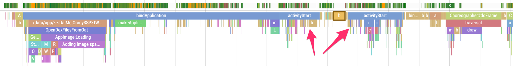
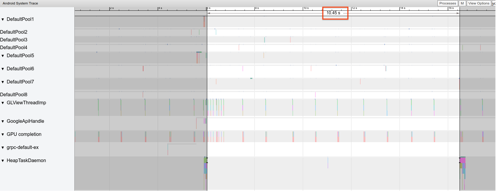
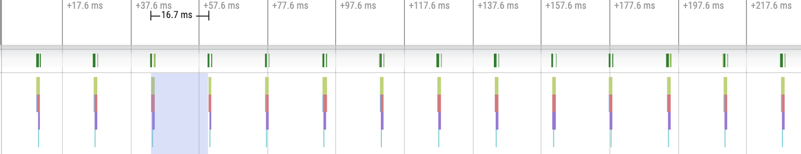
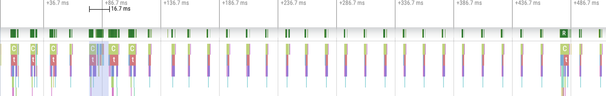
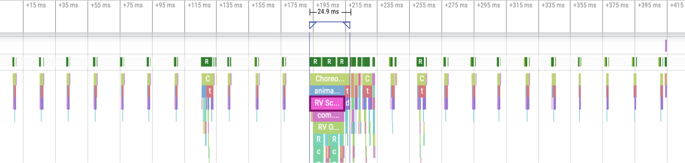
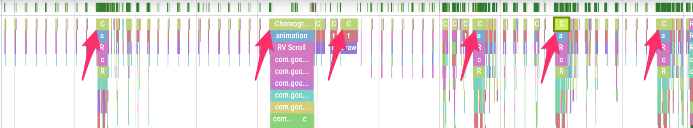

# Android App Audit Runbook

This runbook is intended to give developers the skills to identify and fix key
performance issues in your app independently.

[TOC]

## Key Performance Issues {#key-performance-issues}

*   [Scroll Jank](https://developer.android.com/topic/performance/vitals/render?hl=en#fixing_jank)
    *   "Jank" is the term used to describe the visual hiccup that occurs when
        the system is not able to build and provide frames in time for them to
        be drawn to the screen at the requested cadence (60hz, or higher). Jank
        is most apparent when scrolling, when what should be a smoothly animated
        flow has "catches".
    *   Apps should target 90Hz refresh rates. Many newer devices such as Pixel
        4 operate in 90Hz mode during user interactions like scrolling.
        *   If you're curious what refresh rate your device is using at a given
            time, you can enable an overlay via Developer Options > Show refresh
            rate (under Debugging)
*   Transitions that are not smooth
    *   These concerns arise during interactions such as switching between tabs,
        or loading a new activity. These types of transitions should have smooth
        animations and not include delays or visual flicker.
*   Power Inefficiency
    *   Doing work costs battery, and doing unnecessary work reduces battery
        life.
    *   One common cause of unnecessary work can be related to the GC (garbage
        collector). This can happen when an app is allocating a lot of
        repetitive variables that it only uses for a short time. Then, the
        garbage collector needs to run frequently to clean up those variables.
*   [Startup Latency](https://developer.android.com/topic/performance/vitals/launch-time?hl=en#internals)
    *   Startup latency is the amount of time it takes between clicking on the
        app icon, notification, or other entry point and the user's data being
        shown on the screen.
    *   We have two startup latency goals:
        *   For "cold" starts, the starts that require the most work from the
            app and the system, to start consistently within 500ms.
        *   For the P95/P99 latencies to be very close to the median latency.
            When the app sometimes a very long time to start, user trust is
            eroded. IPCs and unnecessary I/O during the critical path of app
            startup can experience lock contention and introduce these
            inconsistencies.

## Identifying These Issues {#identifying-these-issues}

Generally, the recommended workflow to identify and remedy performance issues is
as follows:

1.  Identify critical user journeys to inspect. These usually include:
    1.  Common startup flows, including from launcher and notification.
    1.  Any screens where the user scrolls through data.
    1.  Transitions between screens.
    1.  Long-running flows, like navigation or music playback.
1.  Inspect what is happening during those flows using debugging tools:
    1.  [Systrace/Perfetto](https://developer.android.com/topic/performance/tracing) -
        Allows you to see exactly what is happening across the entire device
        with precise timing data.
    1.  [Memory Profiler](https://developer.android.com/studio/profile/memory-profiler) -
        Allows you to see what memory allocations are happening on the heap.
    1.  [Simpleperf](https://developer.android.com/ndk/guides/simpleperf) - View
        a flamegraph of what function calls are taking up the most CPU during a
        certain period of time. When you identify something that's taking a long
        time in systrace, but you don't know why, simpleperf can fill in the
        blanks.

Manual debugging of individual test runs is **critical** for understanding and
debugging these performance issues. The above steps **cannot** be replaced by
analyzing aggregated data. However, setting up metrics collection in automated
testing as well as in the field is also important to understand what users are
actually seeing and identify when regressions may occur:

1.  Collect metrics during those flows
    1.  Startup Flows
        1.  Field metrics
            1.  [Play Console startup time](https://support.google.com/googleplay/android-developer/answer/9844486#zippy=%2Capp-start-up-time)
        2.  Lab tests
            1.  [Jetpack Macrobenchmark: Startup](https://android.googlesource.com/platform/frameworks/support/+/androidx-main/benchmark/docs/macrobenchmark.md#startup)
    2.  Jank
        1.  Field metrics
            1.  Play Console frame vitals
                1.  Note that within the Play Console, it's not possible to
                    narrow down metrics to a specific user journey, since all
                    that is reported is overall jank throughout the app.
            2.  Custom measurement with
                [FrameMetricsAggregator](https://developer.android.com/reference/kotlin/androidx/core/app/FrameMetricsAggregator)
                1.  You can utilize FrameMetricsAggregator to record Jank
                    metrics during a particular workflow.
        2.  Lab tests
            1.  [Jetpack Macrobenchmark: Scrolling](https://android.googlesource.com/platform/frameworks/support/+/androidx-main/benchmark/docs/macrobenchmark.md#scrolling-and-animation)
            2.  Macrobenchmark collects frame timing via `dumpsys gfxinfo`
                commands that bracket a user journey in question. This is a
                reasonable way to understand variation in jank over a specific
                user journey. The RenderTime metrics, which highlight how long
                frames are taking to draw, are more important than the count of
                janky frames for identifying regressions or improvements.

## Setting Up Your App for Performance Analysis {#setting-up-your-app-for-performance-analysis}

Proper setup is essential for getting accurate, repeatable, actionable
benchmarks from an application. In general, you want to test on a system that is
as close to production as possible, while suppressing sources of noise. Below
are a number of APK and system specific steps you can take to prepare a test
setup, some of which are use case specific.

### Tracepoints {#tracepoints}

Applications can instrument their code with the
[androidx.tracing.Trace](https://developer.android.com/reference/kotlin/androidx/tracing/Trace)
class. It is strongly recommended to instrument key workloads in your
application to increase the utility of traces, both for local profiling, and for
inspecting results from CI. In Kotlin, the `androidx.tracing:tracing-ktx` module
[makes this very simple](https://developer.android.com/reference/kotlin/androidx/tracing/package-summary?hl=en#trace\(kotlin.String,%20kotlin.Function0\)):

```kotlin
fun loadItemData(configuration: Config) = trace("loadItemData") {
    // perform expensive operation here ...
}
```

While traces are being captured, tracing does incur a small overhead (roughly
5us) per section, so don't put it around every method. Just tracing larger
chunks of work (>0.1ms) can give significant insights into bottlenecks.

### APK Considerations {#apk-considerations}

**Do not measure performance on a
[debug build](https://developer.android.com/studio/debug).**

Debug variants can be helpful for troubleshooting and symbolizing stack samples,
but they have severe non-linear impacts on performance. Devices on Q+ can use
_[profileableFromShell](https://android.googlesource.com/platform/system/extras/+/master/simpleperf/doc/android_application_profiling.md)_
in their manifest to enable profiling in release builds.

Use your production grade
[proguard](https://developer.android.com/studio/build/shrink-code)
configuration. Depending on the resources your application utilizes, this can
have a substantial impact on performance. Note that some proguard configs strip
tracepoints, consider removing those rules for the configuration you're running
tests on

#### Compilation

[Compile](https://source.android.com/devices/tech/dalvik/configure#system_rom)
your application on-device to a known state (generally speed or speed-profile).
Background JIT activity can have a significant performance overhead, and you
will hit it often if you are reinstalling the APK between test runs. The command
to do this is:

```shell
adb shell cmd package compile -m speed -f com.google.packagename
```

The 'speed' compilation mode will compile the app completely; the
'speed-profile' mode will compile the app according to a profile of the utilized
code paths that is collected during app usage. It can be a bit tricky to collect
profiles consistently and correctly, so if you decide to use them, you'll
probably want to confirm they are what you expect. They're located here:

```shell
/data/misc/profiles/ref/[package-name]/primary.prof
```

Note that Macrobenchmark allows you to directly
[specify compilation mode](https://android.googlesource.com/platform/frameworks/support/+/androidx-main/benchmark/docs/macrobenchmark.md#compilation-mode).

### System Considerations {#system-considerations}

For low-level/high fidelity measurements, **calibrate your devices**. Try to run
A/B comparisons across the same device and same OS version. There can be
significant variations in performance, even across the same device type.

On rooted devices, consider using a
[lockClocks script](https://cs.android.com/androidx/platform/frameworks/support/+/androidx-main:benchmark/gradle-plugin/src/main/resources/scripts/lockClocks.sh)
for microbenchmarks. Among other things, these scripts: place CPUs at a fixed
frequency, disable little cores, configure the GPU, and disable thermal
throttling. This is not recommended for user-experience focused tests (i.e app
launch, DoU testing, jank testing, etc.), but can be essential for cutting down
noise in microbenchmark tests.

On rooted devices, consider killing the application and dropping file caches
(“echo 3 > /proc/sys/vm/drop\_caches”) between iterations. This will more
accurately model cold start behavior.

When possible, consider using a testing framework like
[Macrobenchmark](https://android.googlesource.com/platform/frameworks/support/+/androidx-main/benchmark/docs/macrobenchmark.md),
which can reduce noise in your measurements, and prevent measurement inaccuracy.

## Common Problems {#common-problems}

### Slow App Startup: Unnecessary Trampoline Activity {#slow-app-startup-unnecessary-trampoline-activity}

A trampoline activity can extend app startup time unnecessarily, and it's
important to be aware if your app is doing it. As you can see in the example
trace below, one activityStart is immediately followed by another activityStart
without any frames being drawn by the first activity.



This can happen both in a notification entrypoint and a regular app startup
entrypoint, and can often be addressed by refactoring -- can you add the check
you're firing up an activity for as a module that can be shared between
activities?

### Unnecessary Allocations Triggering Frequent GCs {#unnecessary-allocations-triggering-frequent-gcs}

You may note that GCs are happening more frequently than you expect in a
systrace.

In this case, every 10 seconds during a long-running operation is an indicator
that we might be allocating unnecessarily but consistently over time:



Or, you may notice that a specific callstack is making the vast majority of the
allocations when using the Memory Profiler. You don't need to eliminate all
allocations aggressively, as this can make code harder to maintain. Start
instead by working on hotspots of allocations.

### Janky Frames {#janky-frames}

The graphics pipeline is relatively complicated, and there can be some nuance
involved in determining whether a user ultimately may have seen a dropped
frame - in some cases, the platform can "rescue" a frame using buffering.
However, you can ignore most of that nuance to easily identify problematic
frames from your app's perspective.

When frames are being drawn with little work required from the app, the
Choreographer#doFrame tracepoints occur on a 16.7ms cadence (assuming a 60 FPS
device):



If you zoom out and navigate through the trace, you'll sometimes see frames take
a little longer to complete, but that's still okay because they're not taking
more than their allotted 16.7ms time:



But when you actually see a disruption to that regular cadence, that will be a
janky frame:



With a little practice, you'll be able to see them everywhere!



In some cases, you'll just need to zoom into that tracepoint for more
information about which views are being inflated or what RecyclerView is doing.
In other cases, you may have to inspect further.

For more information about identifying janky frames and debugging their causes,
see

[Slow Rendering Vitals Documentation](https://developer.android.com/topic/performance/vitals/render)

### Common RecyclerView mistakes {#common-recyclerview-mistakes}

*   Invalidating the entire RecyclerView's backing data unnecessarily. This can
    lead to long frame rendering times and hence a jank. Instead, invalidate
    only the data that has changed, to minimize the number of views that need to
    update.
    *   See
        [Presenting Dynamic Data](https://developer.android.com/reference/androidx/recyclerview/widget/RecyclerView#presenting-dynamic-data)
        for ways to avoid costly notifyDatasetChanged() calls, when content is
        updated rather than replaced from scratch.
*   Failing to support nested RecyclerViews properly, causing the internal
    RecyclerView to be re-created from scratch every time.
    *   Every nested, inner RecyclerView should have a
        [RecycledViewPool](https://developer.android.com/reference/kotlin/androidx/recyclerview/widget/RecyclerView.RecycledViewPool)
        set to ensure Views can be recycled between inner RecyclerViews
*   Not prefetching enough data, or not prefetching in a timely manner. It can
    be jarring to quickly hit the bottom of a scrolling list and need to wait
    for more data from the server. While this isn't technically "jank" as no
    frame deadlines are being missed, it can be a significant UX improvement
    just to tweak the timing and quantity of prefetching so that the user
    doesn't have to wait for data.

## Tools Documentation {#tools-documentation}

### Using Systrace/Perfetto {#using-systrace-perfetto}

In case you like videos,
[here's a talk](https://www.youtube.com/watch?v=qXVxuLvzKek) summarizing basic
systrace usage.

#### Debugging App Startup Using Systrace {#debugging-app-startup-using-systrace}

The
[Android developer documentation on App startup time](https://developer.android.com/topic/performance/vitals/launch-time)
provides a good overview of the application startup process.

Generally the stages of app startup are:

*   Launch the process
*   Initialize generic application objects
*   Create and Initialize activity
*   Inflate the layout
*   Draw the first frame

Startup types can be disambiguated by these stages:

*   Cold startup -- Start at creating a new process with no
    [saved state](https://developer.android.com/reference/android/os/Bundle).
*   Warm startup -- Either recreates the activity while reusing the process, or
    recreates the process with saved state. The Macrobenchmark testing library
    supports consistent warm startup testing utilizing the first option.
*   Hot startup -- Restarts the activity and starts at inflation.

We recommend capturing systraces
[using the on-device system tracing app available in Developer Options](https://developer.android.com/topic/performance/tracing/on-device).
If you'd like to use command-line tools, [Perfetto](http://perfetto.dev/docs) is
available on Android Q+, while devices on earlier versions should rely on
[systrace](https://developer.android.com/topic/performance/vitals/launch-time).

Note that “first frame” is a bit of a misnomer, applications can vary
significantly in how they handle startup after creating the initial activity.
Some applications will continue inflation for several frames, and others will
even immediately launch into a secondary activity.

When possible, we recommend that app developers include a
[reportFullyDrawn](https://developer.android.com/reference/android/app/Activity#reportFullyDrawn\(\))
(available Q+) call when startup is completed from the application’s
perspective. RFD-defined start times can be extracted through the
[Perfetto trace processor](https://perfetto.dev/docs/analysis/trace-processor),
and a user-visible trace event will be emitted.

Some things that you should look for include:

*   [Monitor contention](app_audit_images/trace_monitor_contention.png) --
    competition for monitor-protected resources can introduce significant delay
    in app startup.
*   [Synchronous binder transactions](app_audit_images/trace_sync_binder.png) --
    Look for unnecessary transactions in your application’s critical path.
*   [Common Sources of Jank](https://developer.android.com/topic/performance/vitals/render#common-jank)
*   [Concurrent garbage collection](app_audit_images/trace_concurrent_gc.png) is
    common and relatively low impact, but if you’re hitting it often consider
    looking into it with the Android Studio memory profiler.
*   Check for [IO](app_audit_images/trace_uninterruptable_sleep.png) performed
    during startup, and look for long stalls.
    *   Note that other processes performing IO at the same time can cause IO
        contention, so ensure that other processes are not running.
*   Significant activity on other threads can interfere with the UI thread, so
    watch out for background work during startup. Note that devices can have
    different CPU configurations, so the number of threads that can run in
    parallel can vary across devices.

### Using Android Studio Memory Profiler {#using-android-studio-memory-profiler}

[Memory profiler documentation](https://developer.android.com/studio/profile/memory-profiler)

The Android Studio memory profiler is a powerful tool to reduce memory pressure
that could be caused by memory leaks or bad usage patterns since it provides a
live view of object allocations

To fix memory problems in your app you can use the memory profiler to track why
and how often garbage collections happen.

The overall steps taken when profiling app memory can be broken down into the
following steps:

#### 1. Detect memory problems

Start recording a memory profiling session of the user journey you care about,
then look for an
[increasing object count](app_audit_images/studio_increasing_object_count.jpg)
which will eventually lead to
[garbage collections](app_audit_images/studio_gc.jpg).

Once you have identified that there is a certain user journey that is adding
memory pressure start analyzing for root causes of the memory pressure.

#### 2. Diagnose memory pressure hot spots

Select a range in the timeline to
[visualize both Allocations and Shallow Size](app_audit_images/studio_alloc_and_shallow_size.jpg).
The are multiple ways to sort this data. Here are some examples of how each view
can help you analyze problems.

##### Arrange by class

Useful when you want to find classes that are generating objects that should
otherwise be cached or reused from a memory pool.

For example: Imagine you see an app creating 2000 objects of class called
“Vertex” every second. This would increase the Allocations count by 2000 every
second and you would see it when sorting by class. Should we be reusing such
objects to avoid generating that garbage? If the answer is yes, then likely
implementing a memory pool will be needed.

##### Arrange by callstack

Useful when there is a hot path where memory is being allocated, maybe inside a
for loop or inside a specific function doing a lot of allocation work you will
be able to find it here.

##### Shallow size vs Retained size, which one should I use to find memory issues?

Shallow size only tracks the memory of the object itself, so it will be useful
for tracking simple classes composed mostly of primitive values only.

Retained Size shows the total memory due to the object and references that are
solely referenced by the object, so it will be useful for tracking memory
pressure due to complex objects. To get this value, take a
[full memory dump](app_audit_images/studio_memory_dump.jpg) and it will be
[added as a column](app_audit_images/studio_retained_size.jpg).

### 3. Measure impact of an optimization

The more evident and easy to measure impact of memory optimizations are GCs.
When an optimization reduces the memory pressure, then you should see fewer GCs.

To measure this, in the profiler timeline measure the time between GCs, and you
should see it taking longer between GCs.

The ultimate impact of memory improvements like this is:

*   OOM kills will likely be reduced if the app does not constantly hit memory
    pressure
*   Having less GCs improves jank metrics, especially in the P99. This is
    because GCs cause CPU contention, which could lead to rendering tasks being
    deferred while GC is happening.
