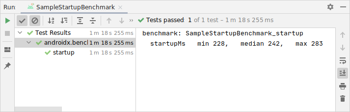
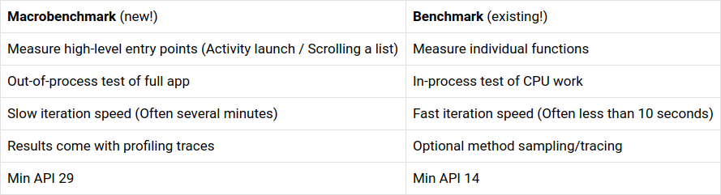
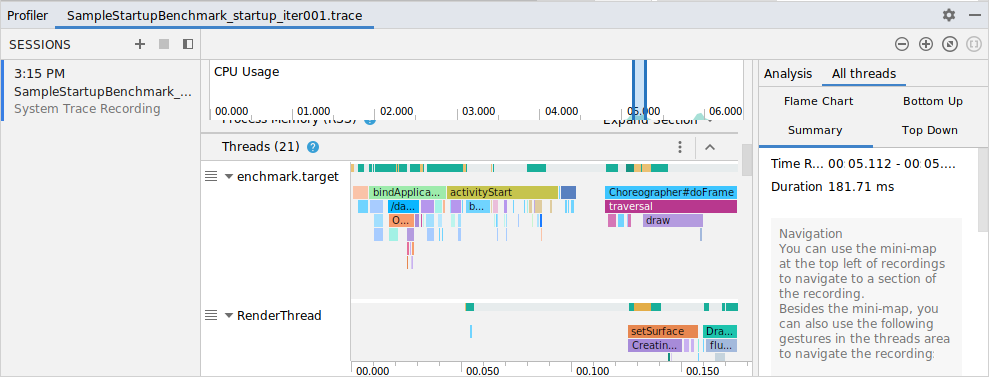
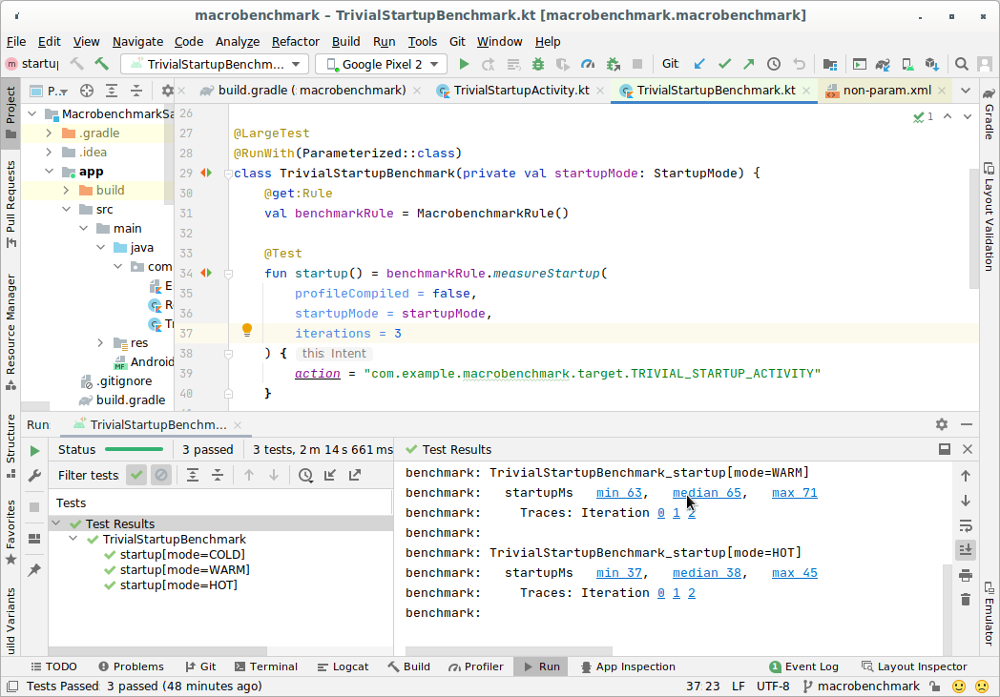
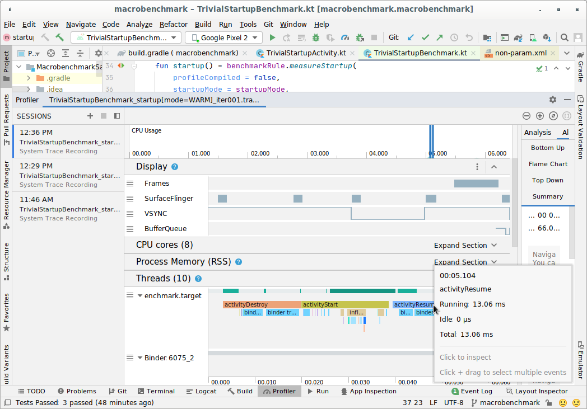

# Jetpack Macrobenchmark Guide

This documentation for the Jetpack Macrobenchmark library will move to
[developer.android.com](https://developer.android.com) when the library is ready
for public release.

NOTE: See [Known Issues](#known-issues) for workarounds for library issues.

[TOC]

## Jetpack Macrobenchmark

Jetpack Macrobenchmark allows you to write startup and scrolling performance
tests directly against your release app on devices running Android 10 (API 29)
or greater. This is provided through the MacrobenchmarkRule JUnit4 rule api:

```kotlin
@get:Rule
val benchmarkRule = MacrobenchmarkRule()

@Test
fun startup() = benchmarkRule.measureRepeated(
    packageName = "mypackage.myapp",
    metrics = listOf(StartupTimingMetric()),
    iterations = 5,
    startupMode = StartupMode.COLD
) { // this = MacrobenchmarkScope
    pressHome()
    val intent = Intent()
    intent.setPackage("mypackage.myapp")
    intent.setAction("mypackage.myapp.myaction")
    startActivityAndWait(intent)
}
```

Metrics are displayed directly in Android Studio, and also output for
[CI usage in a JSON file](#ci-results).



### Macrobenchmark vs Benchmark

While the existing [Jetpack Benchmark](http://d.android.com/benchmark) library
allows you to benchmark app code directly in a loop, it's
[designed around](https://developer.android.com/studio/profile/benchmark#what-to-benchmark)
measuring CPU work which is run frequently, and which will hit best-case
performance (warmed up JIT, disk accesses cached).

Macrobenchmark instead measures end-user experience by actually starting up, and
scrolling your app, providing direct control over the performance environment
you're testing (e.g. you can specify cold, first-time install startup
performance).

<!-- Below table doesn't work on android.googlesource.com, using image as workaround
<table>
    <tr>
      <td><strong>Macrobenchmark</strong> (new!)</td>
      <td><strong>Benchmark</strong> (existing!)</td>
    </tr>
    <tr>
        <td>Measure high-level entry points (Activity launch / Scrolling a list)</td>
        <td>Measure individual functions</td>
    </tr>
    <tr>
        <td>Out-of-process test of full app</td>
        <td>In-process test of CPU work</td>
    </tr>
    <tr>
        <td>Slow iteration speed (Often several minutes)</td>
        <td>Fast iteration speed (Often less than 10 seconds)</td>
    </tr>
    <tr>
        <td>Results come with profiling traces</td>
        <td>Optional method sampling/tracing</td>
    </tr>
    <tr>
        <td>Min API 29</td>
        <td>Min API 14</td>
    </tr>
</table>
-->



## Module Setup


### Configuration

Macrobenchmark currently is only available as a snapshot, so
[add the Androidx snapshot maven artifact to your top level `build.gradle` file](https://androidx.dev/).

Macrobenchmarks are defined in a separate `com.android.library` module. Add a
new library module to your project, and add a dependency on macrobenchmark:

```groovy
dependencies {
    def benchmark_version = '1.1.0-SNAPSHOT'
    androidTestImplementation "androidx.benchmark:benchmark-macro-junit4:$benchmark_version"
}
```

See the [sample macrobenchmark module](https://github.com/android/performance-samples/tree/macrobenchmark/MacrobenchmarkSample/macrobenchmark)
for reference.

### Writing Macrobenchmarks

Unlike microbenchmarks written with `BenchmarkRule`, no gradle plugin is
required.

Now define a new test class in that module, filling in your app's package name:

```kotlin
@RunWith(AndroidJUnit4::class)
class SampleStartupBenchmark {
    @get:Rule
    val benchmarkRule = MacrobenchmarkRule()

    @Test
    fun startup() = benchmarkRule.measureRepeated(
        packageName = "mypackage.myapp",
        metrics = listOf(StartupTimingMetric()),
        iterations = 5,
        startupMode = StartupMode.COLD
    ) { // this = MacrobenchmarkScope
        pressHome()
        val intent = Intent()
        intent.setPackage("mypackage.myapp")
        intent.setAction("mypackage.myapp.myaction")
        startActivityAndWait(intent)
    }
}

```

## App Setup

To macrobenchmark an app (called the *target* of the macrobenchmark), that app
should be configured as close to user experience as possible - non-debuggable,
preferably with minification on (which is beneficial for performance). This is
typically done by installing the `release` variant of the target apk.

As it is necessary to sign your app's `release` variant before building, you can
sign it locally with `debug` keys:

```groovy
    buildTypes {
        release {
            // You'll be unable to release with this config, but it can
            // be useful for local performance testing
            signingConfig signingConfigs.debug
        }
    }
```

Every Activity to be launched by a Macrobenchmark must
[exported](https://developer.android.com/guide/topics/manifest/activity-element#exported).
As of Android 11, this must be enabled explicitly in the app's
AndroidManifest.xml:

```xml
    <activity
        android:name=".MyActivity"
        android:exported="true">
```

Your app will also need to be profileable, to enable reading detailed trace
information. This is enabled in the `<application>` tag of the app's
AndroidManifest.xml:

```xml
    <application ... >
        <!-- Profileable to enable macrobenchmark profiling -->
        <!--suppress AndroidElementNotAllowed -->
        <profileable android:shell="true"/>
        ...
    </application>
```

If the app is misconfigured (debuggable, or non-profileable), macrobenchmark
will throw an error, rather than reporting an incorrect or incomplete
measurement. These configuration errors can be suppressed with the
[`androidx.benchmark.suppressErrors` argument](https://developer.android.com/studio/profile/benchmark#configuration-errors).

Errors are also thrown when attempting to measure an emulator, or on a
low-battery device (as this may compromise core availability and clock
speed).

## Run the Macrobenchmark

Run the test from within Studio to measure the performance of your app on your
device. Note that you **must run the test on a physical device**, and not an
emulator, as emulators do not produce performance numbers representative of
end-user experience.

See the [Benchmarking in CI](#ci) section for information on how to run and
monitor benchmarks in continuous integration.

## Customizing your Macrobenchmark

#### Compilation Mode

Macrobenchmarks can specify a
[CompilationMode](https://cs.android.com/androidx/platform/frameworks/support/+/androidx-main:benchmark/macro/src/main/java/androidx/benchmark/macro/CompilationMode.kt),
which defines how the app should be compiled, just before the test is run.

By default, benchmarks are run with `SpeedProfile`, which runs a few iterations
of your benchmark before measurement, using that profiling data for
profile-driven compilation. This can simulate performance of UI code that has
launched and run before, or which has been
[pre-compiled by the store installing it](https://android-developers.googleblog.com/2019/04/improving-app-performance-with-art.html),

To simulate worst-case, just-after-install performance without pre-compilation,
pass `None`.

This functionality is built on
[ART compilation commands](https://source.android.com/devices/tech/dalvik/jit-compiler#force-compilation-of-a-specific-package).
Each benchmark will clear profile data before it starts, to ensure
non-interference between benchmarks.

#### Startup

To perform an activity start, you can pass a pre-defined startup mode
([one of COLD, WARM, HOT](https://cs.android.com/androidx/platform/frameworks/support/+/androidx-main:benchmark/macro/src/main/java/androidx/benchmark/macro/StartupMode.kt))
to the `measureRepeated` function. This parameter will change how the activity
will be launched, and the process state at the start of the test.

To learn more about the types of startup, see the
[Android Vitals startup documentation](https://developer.android.com/topic/performance/vitals/launch-time#internals).

#### Scrolling and Animation

Unlike most Android UI tests, the macrobenchmarks tests run in a separate
process from the app itself. This is necessary to enable things like killing the
app process, and compiling it via shell commands.

For this reason, you cannot use APIs like `ActivityScenario` which require the
test APK to classload from the instrumentation target. Our samples use
[UI Automator](https://developer.android.com/training/testing/ui-automator) to
drive the app process (e.g. for scrolling).

Instead, you can drive your app via the
[UI Automator library](https://developer.android.com/training/testing/ui-automator)
(or any other means of out-of-process automation). The following example finds a
RecyclerView via resource id, and scrolls down several times:

```kotlin
@Test
fun measureScroll() {
    benchmarkRule.measureRepeated(
        packageName = "mypackage.myapp",
        metrics = listOf(FrameTimingMetric()),
        compilationMode = compilationMode,
        iterations = 5,
        setupBlock = {
            // before starting to measure, navigate to the UI to be measured
            val intent = Intent()
            intent.action = ACTION
            startActivityAndWait(intent)
        }
    ) {
        val recycler = device.findObject(By.res("mypackage.myapp", "recycler_id"))
        // Set gesture margin to avoid triggering gesture nav
        // with input events from automation.
        recycler.setGestureMargin(device.displayWidth / 5)

        // Scroll down several times
        for (i in 1..10) {
            recycler.scroll(Direction.DOWN, 2f)
            device.waitForIdle()
        }
    }
}
```

As the test specifies a `FrameTimingMetric`, the timing of frames will be
recorded and reported as a high level summary of frame timing distribution -
50th, 90th, 95th, and 99th percentile.

Your benchmark doesn't have to scroll UI, it could for example run an animation.
It also doesn't need to use UI automator specifically - as long as frames are
being produced by the View system (which includes frames produced by Compose),
performance metrics will be collected.

## Inspecting a trace

Each measured iteration captures a separate System trace. These result traces
can be opened with
[Studio](https://developer.android.com/studio/profile/cpu-profiler#system-trace)
(via File > Open) or [ui.perfetto.dev](https://ui.perfetto.dev) (via Open trace
file).



NOTE: Android Studio [does not yet support](#studio-trace-access) automatically
pulling trace files off of the device, this step must be performed manually for
now.

Currently, when running tests from Studio, you must manually pull profiling
traces to inspect them after a benchmark run, e.g.:

```shell
# the following command will pull all files ending in .trace
# if you have not overriden the output directory
adb shell ls '/storage/emulated/0/Android/data/*/*/*.trace' \
    | tr -d '\r' | xargs -n1 adb pull
```

Note that your output file path may be different if you customize it with the
`additionalTestOutputDir` argument. You can look for trace path logs in logcat
to see where there are written, for example:

```
I PerfettoCapture: Writing to /storage/emulated/0/Android/data/androidx.benchmark.integration.macrobenchmark.test/cache/TrivialStartupBenchmark_startup[mode=COLD]_iter002.trace.
```

If you invoke the tests instead via gradle command line (e.g. `./gradlew
macrobenchmark:connectedCheck`), these files are pulled automatically to a test
output directory:

```
build/outputs/connected_android_test_additional_output/debugAndroidTest/connected/<device-name>/<module-name>-benchmarkData.json
```

For copying files after command-line benchmark invocation through gradle to
work, you may need to add the following to your `gradle.properties` file:
`android.enableAdditionalTestOutput=true`

## Measuring changes in your app

NOTE: Android Studio does not yet support depending on an app module from a
macrobenchmark, this step will not be necessary in a future version.

**Each time** you want app changes to be reflected in your benchmark
measurements, you must manually update/reinstall the release version of the
target app, for example:

```shell
# Can alternately do this in Studio, via Gradle pane
# on the right, app > Tasks > install > installRelease
./gradlew :myapp:installRelease
```

This can also be done in studio via the Gradle pane: `myAppModule > Tasks >
install > installRelease`

You can avoid the need for this for gradle command line runs by adding the
following to the end of your macrobenchmark module's `build.gradle`

```
// Define a task dependency so the app is installed before we run macro benchmarks.
tasks.getByPath(':macrobenchmark-module:connectedCheck')
    .dependsOn(
            tasks.getByPath(
                    ':myapp:installRelease'
            )
    )
```

## Benchmarking in CI {#ci}

It's common to run test in CI without Gradle, or locally if you're using a
different build system. This section explains how to configure macrobenchmark
for CI usage at runtime.

### Result Files - JSON and Traces {#ci-results}

Macrobenchmark outputs a JSON file, and multiple trace files - one per measured
iteration of each `MacrobenchmarkRule.measureRepeated` loop.

You can define where these files are written by passing in the following
instrumentation argument at runtime:

```
-e additionalTestOutputDir "device_path_you_can_write_to"
```

Note that for simplicity you can specify a path on `/sdcard/`, but you will need
to
[opt-out](https://developer.android.com/training/data-storage/use-cases#opt-out-scoped-storage)
of scoped storage by setting `requestLegacyExternalStorage` to `true` in your
**macrobenchmark** module:

```xml
<manifest ... >
  <application android:requestLegacyExternalStorage="true" ... >
    ...
  </application>
</manifest>
```

Or pass an instrumentation arg to bypass scoped storage for the test:

```shell
-e no-isolated-storage 1
```

NOTE: The file extension of these trace files is currently `.trace`, but will
likely change in the future to clarify that these are perfetto traces.

### JSON Sample

Sample JSON output for a single startup benchmark:

```json
{
    "context": {
        "build": {
            "device": "walleye",
            "fingerprint": "google/walleye/walleye:10/QQ3A.200805.001/6578210:userdebug/dev-keys",
            "model": "Pixel 2",
            "version": {
                "sdk": 29
            }
        },
        "cpuCoreCount": 8,
        "cpuLocked": true,
        "cpuMaxFreqHz": 2457600000,
        "memTotalBytes": 3834605568,
        "sustainedPerformanceModeEnabled": false
    },
    "benchmarks": [
        {
            "name": "startup",
            "params": {},
            "className": "androidx.benchmark.integration.macrobenchmark.SampleStartupBenchmark",
            "totalRunTimeNs": 77969052767,
            "metrics": {
                "startupMs": {
                    "minimum": 228,
                    "maximum": 283,
                    "median": 242,
                    "runs": [
                        238,
                        283,
                        256,
                        228,
                        242
                    ]
                }
            },
            "warmupIterations": 3,
            "repeatIterations": 5,
            "thermalThrottleSleepSeconds": 0
        }
    ]
}
```

## Additional Resources

[A sample project is available](https://github.com/android/performance-samples/tree/macrobenchmark/MacrobenchmarkSample)
as part of the android/performance-samples repository on GitHub, in the
macrobenchmark branch.

For guidance in how to detect performance regressions, see the blogpost
[Fighting Regressions with Benchmarks in CI](https://medium.com/androiddevelopers/fighting-regressions-with-benchmarks-in-ci-6ea9a14b5c71).


## Known Issues

### Missing Metrics

If you see exceptions with the text: `Unable to read any metrics during
benchmark` or `Error, different metrics observed in different iterations.` in a
startup benchmark, these can be caused by the library failing to wait for
Activity launch. As a temporary workaround, you can add a
`Thread.sleep(5000/*ms*/)` at the end of your `measureRepeated {}` block.

### Studio Trace Access {#studio-trace-access}

Support for easy trace access is being added in Android Studio. Once available,
you'll be able to click a result metric, or iteration index, and open the trace
directly in Studio:





## Feedback

To report issues or submit feature requests for Jetpack Macrobenchmark, see the
[public issue tracker](https://issuetracker.google.com/issues/new?component=975669&template=1519452).
