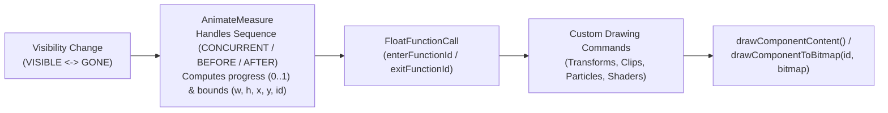

# RemoteCompose Custom Visibility Animation Guide

## Why It Exists

Previously, animating component visibility changes (`VISIBLE` ↔ `GONE` / `INVISIBLE`) in RemoteCompose was limited to built-in presets in `AnimationSpec.ANIMATION` (`FADE_IN`, `FADE_OUT`, `SLIDE_LEFT`, `SLIDE_RIGHT`, `SLIDE_TOP`, `SLIDE_BOTTOM`).

While presets cover basic transitions, rich UI surfaces often require bespoke visual effects when components appear or disappear—such as:
- **Multi-stage transforms and layer compositing** (elastic pop-in, 3D card flips, or dramatic cloud puffs).
- **Procedural slicing and shattering** (splitting a live component into clipped strips or 3D textured cubes).
- **Hardware-accelerated AGSL shader transitions** (shader melt, liquid drain & fill, CRT television turn-off, dust disintegration, or 3D page curls).
- **Coordinated layout sequencing** (playing an exit animation *before* siblings collapse the gap, or opening layout space *before* an entering component animates in).

**Custom Visibility Animations** solve this by allowing documents to define programmable enter and exit drawing functions that execute entirely on the player side at 60–120fps with zero round-trips to the host process, while dynamically adapting to the component's runtime measured size and display density.

---

## How It Works



### 1. Parameterized Animation Functions (`FloatFunctionDefine`)
A custom visibility animation is registered in the document as a reusable function (`FloatFunctionDefine`, opcode `192`) that accepts 6 runtime parameters (exposed in the DSL as `(component: RcComponent, progress: RcFloat, width: RcFloat, height: RcFloat, x: RcFloat, y: RcFloat)`):

| Index | Parameter | Description |
| :--- | :--- | :--- |
| `0` | `progress` | Normalized transition progress from `0.0` (start of transition) to `1.0` (end of transition), after applying `visibilityEasingType`. |
| `1` | `width` | The component's runtime measured width (in pixels, scaled by density when `DENSITY_BEHAVIOR_DP` is active). |
| `2` | `height` | The component's runtime measured height. |
| `3` | `x` | The component's X coordinate relative to its parent container (`mComponent.getX()`). |
| `4` | `y` | The component's Y coordinate relative to its parent container (`mComponent.getY()`). |
| `5` | `component` | The runtime component reference (`mComponent.getComponentId()`), exposed as `RcComponent` in the DSL (`id` in JSON). |

### 2. Linking to Components & Layout Sequencing (`AnimationSpec`)
`AnimationSpec` extends its wire format with `enterFunctionId`, `exitFunctionId`, and sequence ordering (`enterSequence`, `exitSequence` using `AnimationSpec.SEQUENCE`):
- **Entering (`GONE` / `INVISIBLE` → `VISIBLE`)**: If `enterFunctionId != -1`, `AnimateMeasure` invokes `enterFunctionId` on each frame with `progress` advancing from `0.0` to `1.0`.
- **Exiting (`VISIBLE` → `GONE` / `INVISIBLE`)**: If `exitFunctionId != -1`, `AnimateMeasure` keeps the component alive during the transition and invokes `exitFunctionId` with `progress` advancing from `0.0` to `1.0`.

#### Layout Sequence Modes (`AnimationSpec.SEQUENCE`)
Both `enterSequence` and `exitSequence` default to `AnimationSpec.SEQUENCE.CONCURRENT`:

| Sequence Mode | Behavior on Exit (`exitSequence`) | Behavior on Enter (`enterSequence`) |
| :--- | :--- | :--- |
| **`CONCURRENT`** *(default)* | Visibility exit (`0..visibilityDuration`) and sibling layout movement (`0..motionDuration`) happen simultaneously. | Sibling layout movement (`0..motionDuration`) and visibility enter (`0..visibilityDuration`) happen simultaneously. |
| **`BEFORE`** | The component stays in its layout slot (`isGone()` remains `false`) while the exit animation runs (`0..visibilityDuration`). Once complete, it releases its layout slot and triggers layout re-measure so siblings smoothly animate (`0..motionDuration`) into the freed space. | The entering component runs its visibility animation (`0..visibilityDuration`) before layout relocation (`motionDuration..motionDuration + visibilityDuration`). |
| **`AFTER`** | Layout space is released immediately so siblings animate (`0..motionDuration`) first, and the exit animation runs after (`motionDuration..motionDuration + visibilityDuration`). | Layout space is reserved first so siblings animate out of the way (`0..motionDuration`) while the entering component remains hidden (`progress = 0`). Once the layout settles, the enter animation plays (`motionDuration..motionDuration + visibilityDuration`). |

### 3. Rendering the Live Component (`drawComponentContent`)
Inside a custom visibility animation block, calling `drawComponentContent()` (`DrawContent` operation) automatically wraps `Component.paintingComponent(context)` in an offscreen layer (`context.saveLayer(target.getX(), target.getY(), target.getWidth(), target.getHeight())`) using a layer paint carrying the current paint `alpha`, while resetting the inner paint `alpha` to `255` so the component's background, borders, text, and child hierarchy render at full opacity into the layer before compositing as a single unit. In addition, `AnimateMeasure` isolates each custom animation execution inside `save()` / `savePaint()` and `restorePaint()` / `restore()` so custom paint state never leaks to sibling components.

Because `drawComponentContent()` automatically composites with the active paint in an offscreen layer:
- You can set `paint { alpha(progress) }` and call `drawComponentContent()` inside `scale` / `rotate` / `skew` / `translate` to transform and fade the entire subtree as a single composited unit without requiring an explicit `saveLayer` operation.
- You can call it **multiple times with different `clipRect` bounds** to slice the component into strips, shutters, or 3D textured cube faces.
- You can call `drawComponentToBitmap(component, offscreenBitmap)` to capture the component identified by `component` (`RcComponent`) into an offscreen texture at `(0, 0)` and feed it into an AGSL `RuntimeShader`.

### 4. Lazy Pooled Offscreen Bitmaps (`createOffscreenBitmap()` & `drawComponentToBitmap()`)
Component dimensions are typically only known at runtime after layout measurement and density scaling. Calling `createOffscreenBitmap()` emits a `BitmapData` operation with `BitmapData.ENCODING_COMPONENT_OFFSCREEN_BUFFER`. When applied during a component's visibility animation (or prepared by `DrawToBitmap`), `BitmapData` resolves the associated component, updates its width and height to match the component's bounds, and lazily acquires a reusable backing `Bitmap` of at least `(component.width, component.height)` from `BitmapData`'s platform-independent offscreen bitmap pool in `remote-core` (bounded by `Limits.MAX_BITMAP_POOL_SIZE`). When `drawComponentToBitmap(component, offscreenBitmap)` executes, `DrawToBitmap` pushes an offscreen target onto `PaintContext`, clips the offscreen canvas to `(width, height)`, and renders the component at `(0, 0)`. Each `AnimateMeasure` visibility animation executes inside a scoped pool frame (`BitmapData.pushOffscreenScope` / `BitmapData.popOffscreenScope`), returning bitmaps acquired in that scope to the pool and restoring any previous `BitmapData` bindings when the scope completes.

### 5. Interruptible Mid-Flight Retargeting
If a component's visibility is toggled again while an enter or exit animation is still running, `Component` updates the existing `AnimateMeasure` target in place rather than spawning a duplicate transition, smoothly reversing from the current visual state.

### 6. Nested Component Visibility Animations
Parent and child components can run custom visibility animations simultaneously—even when both reference the exact same `defineVisibilityAnimation` (`FloatFunctionDefine`) and `createOffscreenBitmap()`:
- **Re-entrant Function Execution & Argument Preservation**: `FloatFunctionDefine` uses a bounded execution depth counter (`MAX_EXECUTION_DEPTH = 16`), and `AnimateMeasure` saves and restores the enclosing animation's function arguments (`progress, width, height, x, y, id`) whenever a nested execution occurs (`fn.getExecutionDepth() > 0`).
- **Scoped Bitmap Pool & Binding Restoration**: `BitmapData.pushOffscreenScope` / `popOffscreenScope` isolates each nested animation's pooled bitmaps and restores the parent's `BitmapData` dimensions, target component ID, and backing buffer in `RemoteContext` when the child scope exits.
- **Stack-Based Offscreen Target & Canvas Switching**: `PaintContext.pushOffscreenTarget` / `popOffscreenTarget` and the player canvas stacks (`AndroidPaintContext` / `ComposePaintContext`) ensure nested `drawComponentToBitmap` calls restore back to the enclosing offscreen bitmap canvas rather than the root canvas.

---

## Examples

### Example 1: Elastic Pop & Layer Fade with Layout Sequencing (Kotlin DSL)

Use `defineVisibilityAnimation` in `RcScope` together with `paint { alpha(...) }`, `drawComponentContent()`, and `enterSequence` / `exitSequence`:

```kotlin
val popEnter = defineVisibilityAnimation { _, progress, w, h, x, y ->
    val cx = x + w / 2f
    val cy = y + h / 2f
    val inv = 1f - progress
    val scaleVal = 0.4f + 0.6f * progress

    save {
        paint { alpha(progress) }
        rotate(inv * -15f, cx, cy)
        scale(scaleVal, scaleVal, cx, cy)
        drawComponentContent()
    }
}

val puffExit = defineVisibilityAnimation { _, progress, w, h, x, y ->
    val cx = x + w / 2f
    val cy = y + h / 2f
    val inv = 1f - progress

    // 1. Shrink and fade out the component content
    save {
        paint { alpha(inv * inv) }
        val s = 1f - 0.35f * progress
        scale(s, s, cx, cy)
        drawComponentContent()
    }

    // 2. Draw expanding cloud puffs around the center
    paint {
        color(0xFFE2E8F0.toInt())
        alpha(inv)
    }
    val radius = (w * 0.15f) * (0.5f + progress)
    val dist = (w * 0.4f) * progress
    drawCircle(cx - dist, cy - dist * 0.3f, radius)
    drawCircle(cx + dist, cy - dist * 0.2f, radius * 0.9f)
    drawCircle(cx, cy - dist * 0.5f, radius * 1.1f)
}

// Attach to any component:
Box(
    modifier = Modifier
        .width(260)
        .height(48)
        .visibility(cardVisibilityId)
        .animationSpec(
            motionDuration = 350f,
            visibilityDuration = 600f,
            visibilityEasingType = GeneralEasing.CUBIC_STANDARD,
            enterFunctionId = popEnter,
            exitFunctionId = puffExit,
            enterSequence = AnimationSpec.SEQUENCE.AFTER,
            exitSequence = AnimationSpec.SEQUENCE.BEFORE,
        )
) {
    Text("Click to toggle visibility")
}
```

---

### Example 2: Multi-Slice Clipping / Shutter Blinds (Kotlin DSL)

Because `drawComponentContent()` can be invoked multiple times inside a loop or unrolled slices, you can clip the component into independent horizontal or vertical bands that slide and fade out with staggered delays:

```kotlin
val shutterExit = defineVisibilityAnimation { _, progress, w, h, x, y ->
    val numSlices = 6
    val sliceH = h / numSlices.toFloat()

    for (i in 0 until numSlices) {
        val delay = i * 0.08f
        val localP = ((progress - delay) / (1f - delay)).coerceIn(0f, 1f)
        val inv = 1f - localP
        val top = y + sliceH * i.toFloat()
        val bottom = top + sliceH
        val direction = if (i % 2 == 0) 1f else -1f
        val offsetX = direction * localP * localP * (w * 0.6f)

        save {
            paint { alpha(inv) }
            translate(offsetX, 0f)
            clipRect(x, top, x + w, bottom)
            drawComponentContent()
        }
    }
}
```

---

### Example 3: Pooled Offscreen Texture + AGSL Shader (`createOffscreenBitmap` & `drawComponentToBitmap`)

Use `createOffscreenBitmap()` directly inside `defineVisibilityAnimation` and pass `component` (`RcComponent`) to `drawComponentToBitmap(component, offscreenBitmap)` to capture the live component at `(0, 0)` in a lazily pooled runtime bitmap and feed it as a `BitmapShader` uniform into an AGSL shader:

```kotlin
val rippleShaderSrc = """
    uniform shader uContent;
    uniform float2 uResolution;
    uniform float uProgress;

    half4 main(float2 coord) {
        float2 uv = coord / uResolution;
        float2 center = float2(0.5, 0.5);
        float2 d = uv - center;
        float dist = length(d);
        float wave = sin(dist * 40.0 - uProgress * 18.0) * 0.03 * uProgress;
        float2 sampleCoord = (uv + normalize(d + 0.0001) * wave) * uResolution;
        half4 color = uContent.eval(clamp(sampleCoord, float2(0.0), uResolution - 1.0));
        return color * (1.0 - uProgress);
    }
""".trimIndent()

val rippleExit = defineVisibilityAnimation { component, progress, w, h, x, y ->
    // 1. Reserve a lazy offscreen bitmap handle (backed by the player's bitmap pool)
    val offscreenBitmap = createOffscreenBitmap()
    val shaderId = shader(rippleShaderSrc) {
        uniform("uContent", offscreenBitmap)
        uniform("uResolution", w, h)
        uniform("uProgress", progress)
    }

    // 2. Render live component content at (0, 0) into the pooled offscreen bitmap
    drawComponentToBitmap(component, offscreenBitmap)

    // 3. Draw on the main canvas with the AGSL shader
    save {
        translate(x, y)
        paint { shader(shaderId) }
        drawRect(0f.rf, 0f.rf, w, h)
        paint { clearShader() }
    }
}
```

---

### Example 4: Declarative JSON Format (`defineVisibilityAnimation`)

In the RemoteCompose JSON format, define named visibility animations with `defineVisibilityAnimation` (supporting up to 6 parameters `["progress", "w", "h", "x", "y", "id"]`, `"createOffscreenBitmap"`, and `"drawComponentToBitmap"`) and reference them by `@name` in `animationSpec` along with optional `enterSequence` / `exitSequence` (`"CONCURRENT"`, `"BEFORE"`, or `"AFTER"`):

```json
{
  "header": { "apiLevel": 8, "profiles": 513, "densityBehavior": 2 },
  "root": [
    { "variable": { "name": "cardVis", "vtype": "integer", "value": 1 } },
    {
      "defineVisibilityAnimation": {
        "name": "customEnter",
        "params": ["progress", "w", "h", "x", "y", "id"],
        "commands": [
          { "variable": { "name": "cx", "value": "@x + @w / 2" } },
          { "variable": { "name": "cy", "value": "@y + @h / 2" } },
          {
            "save": [
              { "paint": { "alpha": "@progress" } },
              { "rotate": { "angle": "(1 - @progress) * -90", "pivotX": "@cx", "pivotY": "@cy" } },
              { "scale": { "sx": "@progress", "sy": "@progress", "pivotX": "@cx", "pivotY": "@cy" } },
              { "type": "drawComponentContent" }
            ]
          }
        ]
      }
    },
    {
      "box": {
        "modifiers": [
          { "visibility": "@cardVis" },
          {
            "animationSpec": {
              "motionDuration": 350,
              "visibilityDuration": 500,
              "enterFunction": "@customEnter",
              "enterSequence": "AFTER",
              "exitSequence": "BEFORE"
            }
          }
        ]
      }
    }
  ]
}
```
