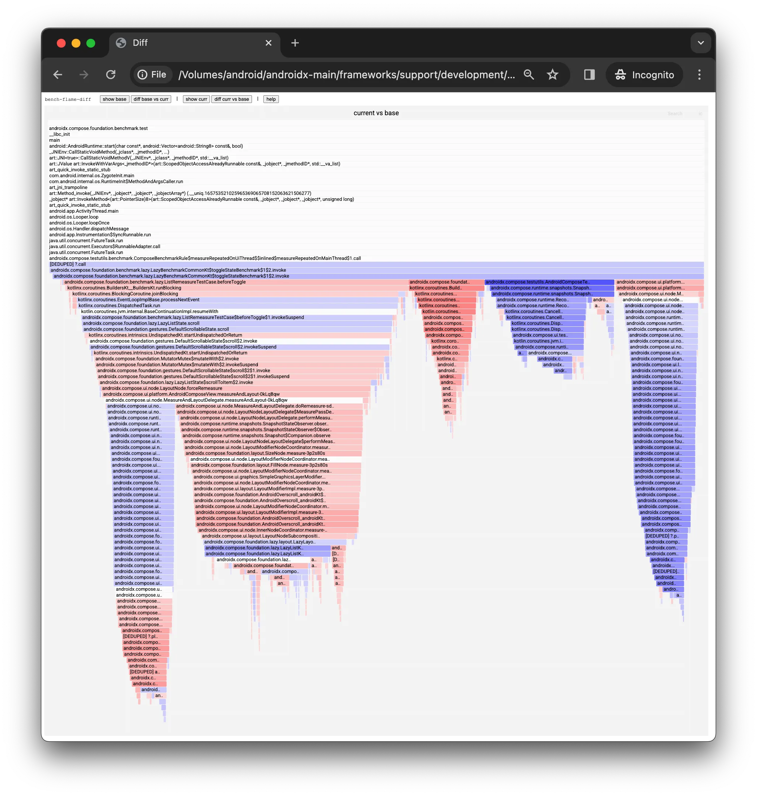

# Overview

The project provides an easy way to save before/after CPU traces from Microbenchmark runs, and compare them visually using Differential Flame Graphs.



Areas where the code got slower are highlighted in red, while areas that are now faster are marked in blue; the intensity of the colour is proportional to the size of the difference.

See also the [end-to-end demo (video)](https://drive.google.com/file/d/119nI_zlAMbTHzh-Rdzf8UuUVCGEKnKFQ/view?usp=drive_link&resourcekey=0-SRRmKgVZYfAlnkL4Hvh-cg).

# Usage

## Interacting with the script

- Overview of all commands: `./bench-flame-diff.sh -h`
- Help for a specific command: `./bench-flame-diff.sh <command> -h`

## First usage

On first usage, initialise all dependencies by running: `./bench-flame-diff.sh init`

## General workflow

1. Run a specific Microbenchmark with CPU Stack sampling enabled (see below for instructions)
1. Save the trace as _base_ for comparison using `./bench-flame-diff.sh save`. It's worth picking a good names for the saved traces since you're likely going to e.g. re-use the _base_ while iterating on code changes.
1. Apply changes in your code and run the same benchmark as in step 1
1. Save the trace as _current_ `./bench-flame-diff.sh save`
1. Compare both traces using `./bench-flame-diff.sh diff` which will create and open a diff in a web browser
1. Toggle between graphs using the buttons on the top:
   - `base`: flamegraph for the _base_ trace
   - `base-vs-curr`: differential flame graph showing _base_ vs _current_ on the _base_ trace
   - `curr`: flamegraph for the _current_ trace
   - `curr-vs-base`: differential flame graph showing _base_ vs _current_ on the _current_ trace
1. You can later go back to generated diffs using `./bench-flame-diff.sh open`

# Misc

## Enabling stack sampling in Benchmark traces

This can be done in CLI or by editing `build.gradle`. Full documentation is [here](https://developer.android.com/topic/performance/benchmarking/microbenchmark-profile).

Quick CLI example:
```
# pick a target benchmark
tgt=:compose:foundation:foundation-benchmark:connectedCheck

# create a regex that targets a specific benchmark (test)
test_rx="androidx.compose.foundation.benchmark.lazy.LazyListScrollingBenchmark.scrollProgrammatically_noNewItems\[.*Row.*\]"

# run the benchmark and gather a 5 second (default) stack sample at 1000 Hz (default)
./gradlew $tgt -Pandroid.testInstrumentationRunnerArguments.tests_regex="$test_rx" \
 -P android.testInstrumentationRunnerArguments.androidx.benchmark.profiling.mode=StackSampling \
 -P android.testInstrumentationRunnerArguments.androidx.benchmark.profiling.sampleDurationSeconds=5 \
 -P android.testInstrumentationRunnerArguments.androidx.benchmark.profiling.sampleFrequency=1000
```

## CLI completion

Generate shell-specific completion files with `./generate-completion.sh`.

Then, source in your shell config, e.g.:
- For `bash`: `dst="$(pwd)/completion_bash.sh"; echo "source '$dst'" >> ~/.bashrc`
- For `zsh`: `dst="$(pwd)/completion_zsh.sh"; echo "source '$dst'" >> ~/.zshrc`

After restarting the shell session, you will be able to 'tab-autocomplete' commands and argument names.

# Dependencies

On top of dependencies discoverable with `./gradlew app:dependencies` the project depends on:
- https://github.com/brendangregg/FlameGraph
- https://android.googlesource.com/platform/system/extras/+/refs/heads/main/simpleperf/scripts

Both are fetched from the network in the `init` command and pinned to known-good-revisions.

# Reporting issues

File an issue on Buganizer using [this link](https://b.corp.google.com/issues/new?component=1229612&hotlistIds=3622386&hotlistIds=5709693&assignee=jgielzak@google.com&title=bench-flame-diff:%20) or reach out directly to [jgielzak@](http://go/moma/chat?with=jgielzak).

Known issues and future work items are tracked [here](https://b.corp.google.com/hotlists/5709693).
