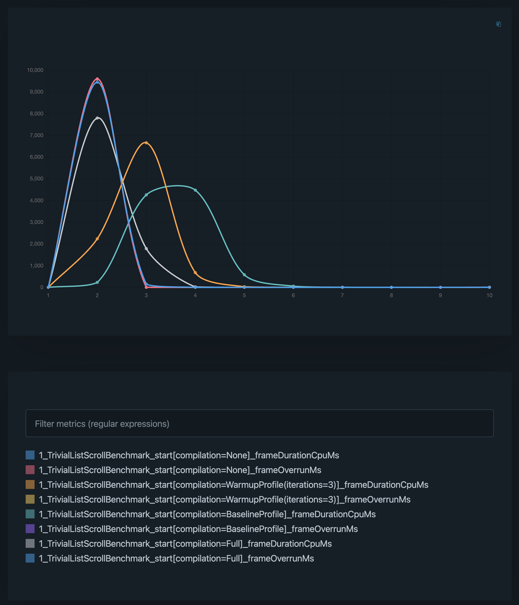
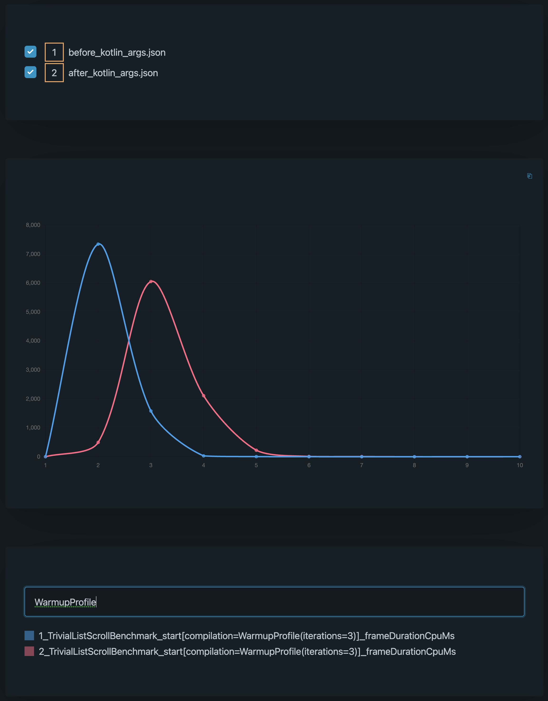

# Plot Benchmark Results

This tool helps plot benchmark results, and compare them with past results. <br/>
Just drag and drop benchmark results `json` files, to visualize & compare data.

<br/>



<br/>



## Setup

### Install FNM

[FNM](https://github.com/Schniz/fnm) manages versions of `Node.js` installed.

After you install `fnm` and add it to your `$PATH`, you should be able to do the following.

```bash
➜  plot-benchmarks git:(viz-benchmarks) ✗ fnm use
Using Node v18.16.0
```

Note: `fnm use` might prompt you to install the version of Node.js being [used](.nvmrc).

### Install Dependencies

Now, you are ready to install all the dependencies.

```bash
# Installs the necessary dependencies.
npm install
```

### Running Local Dev Server

```bash
# Compiles the code, and hot-deploys code to the local dev server.
npm run-script dev

VITE v4.3.9  ready in 168 ms

➜  Local:   http://localhost:5173/
➜  Network: use --host to expose
➜  press h to show help
```

Now navigate to the URL listed in the output.

### Usage

* Drag and drop benchmark results (`*.json`) files into the page.
* Double clicking the items on the legend, toggles the visibility of the dataset in the chart.
* You can also filter metrics to plot.
* To compare benchmark runs, just load both results into the page, and select the ones you want to compare.

Have fun !

