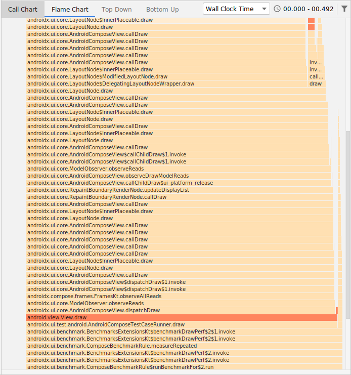

# Benchmarking in AndroidX

[TOC]

The public documentation at
[d.android.com/benchmark](http://d.android.com/benchmark) explains how to use
the library - this page focuses on specifics to writing libraries in the
AndroidX repo, and our continuous testing / triage process.

This page is for MICRO benchmarks measuring CPU performance of small sections of
code. If you're looking for measuring startup or jank, see the guide for
MACRObenchmarks [here](/docs/macrobenchmarking.md).

### Writing the benchmark

Benchmarks are just regular instrumentation tests! Just use the
[`BenchmarkRule`](https://developer.android.com/reference/kotlin/androidx/benchmark/junit4/BenchmarkRule)
provided by the library:

<section class="tabs">

#### Kotlin {.new-tab}

```kotlin
@RunWith(AndroidJUnit4::class)
class ViewBenchmark {
    @get:Rule
    val benchmarkRule = BenchmarkRule()

    @Test
    fun simpleViewInflate() {
        val context = InstrumentationRegistry
                .getInstrumentation().targetContext
        val inflater = LayoutInflater.from(context)
        val root = FrameLayout(context)

        benchmarkRule.measure {
            inflater.inflate(R.layout.test_simple_view, root, false)
        }
    }
}
```

#### Java {.new-tab}

```java
@RunWith(AndroidJUnit4.class)
public class ViewBenchmark {
    @Rule
    public BenchmarkRule mBenchmarkRule = new BenchmarkRule();

    @Test
    public void simpleViewInflate() {
        Context context = InstrumentationRegistry
                .getInstrumentation().getTargetContext();
        final BenchmarkState state = mBenchmarkRule.getState();
        LayoutInflater inflater = LayoutInflater.from(context);
        FrameLayout root = new FrameLayout(context);

        while (state.keepRunning()) {
            inflater.inflate(R.layout.test_simple_view, root, false);
        }
    }
}
```

</section>

## Project structure

As in the public documentation, benchmarks in the AndroidX repo are test-only
library modules. Differences for AndroidX repo:

1.  Module *must* apply `id("androidx.benchmark")` in the plugin block
1.  Module *should* live in `integration-tests` group directory to follow
    convention
1.  Module name *should* end with `-benchmark` in `settings.gradle` to follow
    convention
1.  Module *should not* contain non-benchmark tests to avoid wasting resources
    in benchmark postsubmit

Applying the benchmark plugin give you benefits from the AndroidX plugin:

*   Inclusion in microbenchmark CI runs
*   AOT Compilation of module (local and CI) for stability
*   Disable ANR avoidance in local runs (so you always get method traces)

But note that these can be detrimental for non-benchmark code.

### I'm lazy and want to start quickly

Start by copying one of the following non-Compose projects:

*   [navigation-benchmark](https://cs.android.com/androidx/platform/frameworks/support/+/androidx-main:navigation/navigation-benchmark/)
*   [recyclerview-benchmark](https://cs.android.com/androidx/platform/frameworks/support/+/androidx-main:recyclerview/recyclerview-benchmark/)

Many Compose libraries already have benchmark modules:

*   [Compose UI Benchmarks](https://cs.android.com/androidx/platform/frameworks/support/+/androidx-main:compose/ui/ui/benchmark/)
*   [Compose Runtime Benchmarks](https://cs.android.com/androidx/platform/frameworks/support/+/androidx-main:compose/runtime/runtime/compose-runtime-benchmark/)
*   [Compose Material Benchmarks](https://cs.android.com/androidx/platform/frameworks/support/+/androidx-main:compose/material/material/benchmark/)
*   [Wear Compose Material Benchmarks](https://cs.android.com/androidx/platform/frameworks/support/+/androidx-main:wear/compose/compose-material/benchmark/)

## Profiling

See the
[public profiling guide](https://developer.android.com/studio/profile/benchmark#profiling)
for more details.

Jetpack benchmark supports capturing profiling information by setting
instrumentation arguments. Stack sampling and method tracing can be performed
either from CLI or Studio invocation.

### Set Arguments in Gradle

Args can be set in your benchmark's `build.gradle`, which will affect both
Studio / command-line gradlew runs. Runs from Studio will link result traces
that can be opened directly from the IDE.

```
android {
    defaultConfig {
        // must be one of: 'None', 'StackSampling', or 'MethodTracing'
        testInstrumentationRunnerArgument 'androidx.benchmark.profiling.mode', 'StackSampling'
    }
}
```

### Set Arguments on Command Line

Args can also be passed from CLI. Here's an example which runs the
`androidx.compose.material.benchmark.CheckboxesInRowsBenchmark#draw` method with
`StackSampling` profiling:

```
./gradlew compose:material:material-benchmark:cC \
    -P android.testInstrumentationRunnerArguments.androidx.benchmark.profiling.mode=StackSampling \
    -P android.testInstrumentationRunnerArguments.class=androidx.compose.material.benchmark.CheckboxesInRowsBenchmark#draw
```

The command output will tell you where to look for the file on your host
machine:

```
04:33:49 I/Benchmark: Benchmark report files generated at
/androidx-main/out/ui/ui/integration-tests/benchmark/build/outputs/connected_android_test_additional_output
```

To inspect the captured trace, open the appropriate `*.trace` file in that
directory with Android Studio, using `File > Open`.

NOTE For stack sampling, it's recommended to profile on Android Q(API 29) or
higher, as this enables the benchmark library to use
[Simpleperf](https://android.googlesource.com/platform/system/extras/+/master/simpleperf/doc/)
when capturing samples.

For more information on the `StackSampling` and `MethodTracing` profiling modes,
see the
[Studio Profiler recording configuration docs](https://developer.android.com/studio/profile/record-traces#configurations),
specifically "Sample C/C++ Functions" (called "Callstack sample" in recent
versions), and Java Method Tracing.



### Advanced: Connected Studio Profiler

Profiling for allocations requires Studio to capture, and a debuggable build. Do
not commit the following changes.

First, set your benchmark to be debuggable in your benchmark module's
`androidTest/AndroidManifest.xml`:

```
  <application
    ...
    android:debuggable="false"
    tools:ignore="HardcodedDebugMode"/>
```

Note that switching to the debug variant will likely not work, as Studio will
fail to find the benchmark as a test source.

Next select `ConnectedAllocation` in your benchmark module's `build.gradle`:

```
android {
    defaultConfig {
        // --- Local only, don't commit this! ---
        // pause for manual profiler connection before/after a single run of
        // the benchmark loop, after warmup
        testInstrumentationRunnerArgument 'androidx.benchmark.profiling.mode', 'ConnectedAllocation'
    }
}
```

Run `File > Sync Project with Gradle Files`, or sync if Studio asks you. Now any
benchmark runs in that project will permit debuggable, and pause before and
after the test, to allow you to connect a profiler and start recording, and then
stop recording.

#### Running and Profiling

After the benchmark test starts, you have about 20 seconds to connect the
profiler:

1.  Click the profiler tab at the bottom
1.  Click the plus button in the top left, `<device name>`, `<process name>`
1.  Click the memory section, and right click the window, and select `Record
    allocations`.
1.  Approximately 20 seconds later, right click again and select `Stop
    recording`.

If timed correctly, you'll have started and stopped collection around the single
run of your benchmark loop, and see all allocations in detail with call stacks
in Studio.

## Minification / R8

As many Android apps don't yet enable R8, the default for microbenchmarks in
AndroidX is to run with R8 disabled to measure worst-case performance. It may
still be useful to run your microbenchmarks with R8 enabled locally however, and
that is supported experimentally. To do this in your microbench module, set the
**androidTest** minification property:

```
android {
    buildTypes.release.androidTest.enableMinification = true
}
```

Then, if you see any errors from classes not found at runtime, you can add
proguard rules
[here](https://cs.android.com/androidx/platform/frameworks/support/+/androidx-main:compose/benchmark-utils/proguard-rules.pro),
or in a similar place for your module.
