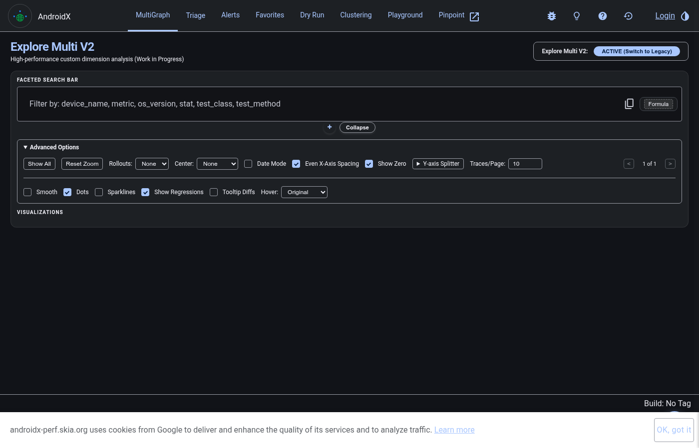
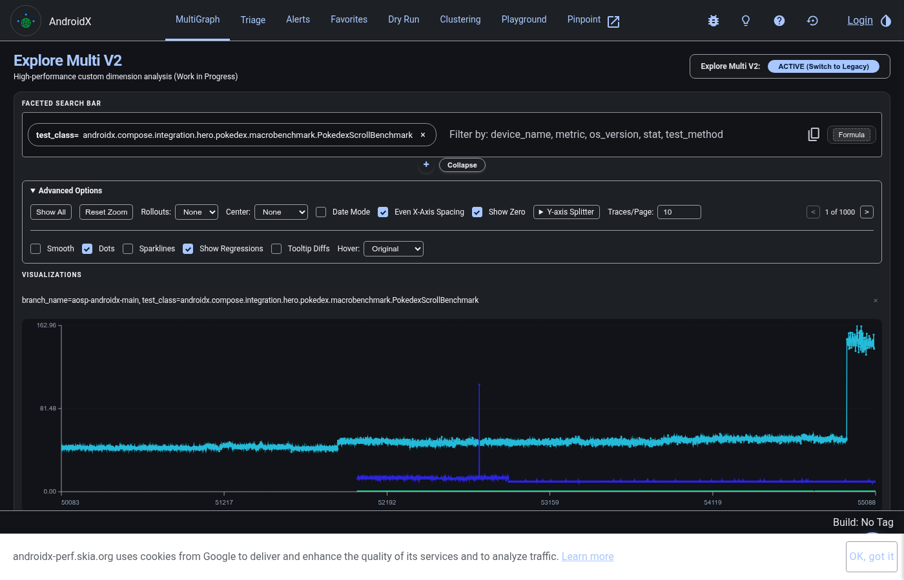
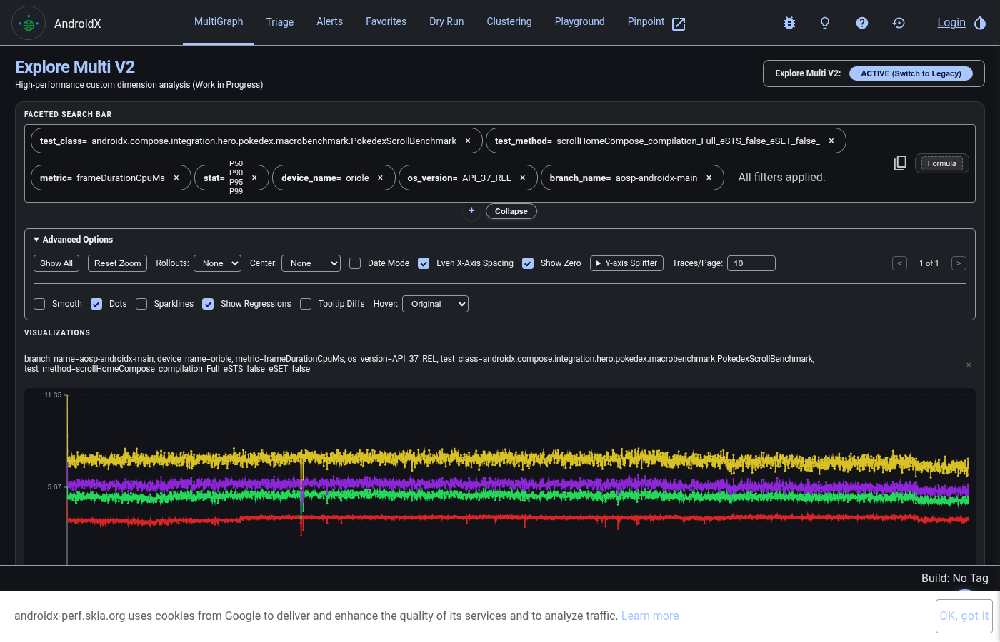

# Performance Monitoring

[TOC]

All AndroidX benchmarks run continuously in Android Engprod infra (unlike
correctness tests), and can be monitored via our instance of Skia Perf -
https://androidx-perf.skia.org.

NOTE: While all benchmark metrics are uploaded and can be inspected, regression
detection only applies to a specific subset on specific devices, defined
[here](https://androidx-perf.skia.org/a). If you want a new metric to trigger
regressions, start a discussion on go/androidx-bench-chat.

### Contributor Expectations

-   Respect the limited device pool available, and only enable a minimal amount
    of benchmarks in CI to cover your code.

    -   For example, avoid excessive parameterization in CI, consider leaving
        the additional configurations commented out for local
        evaluation/experimentation

-   Document observed changes in runtime on your device for each CL that adds
    benchmarks, or adds significantly to existing benchmarks

    -   E.g. estimated added post-submit runtime(per-device)

### Triage

See go/androidx-bench-triage for triage process.

### Graphing CI Results

Go to the Home page of AndroidX Skia Perf: https://androidx-perf.skia.org

1.  Select the `test_class` parameter in the search bar (e.g.
    `androidx.compose.integration.hero.pokedex.macrobenchmark.PokedexScrollBenchmark`):

    

2.  Select the remaining query parameters (`test_method`, `metric`, `stat`,
    `device_name`, `os_version`) to render the performance graph automatically:

    

Here is a quick overview of what each parameter filter means:

*   `test_class` - The test class containing the benchmark methods.
*   `test_method` - The specific benchmark method being measured. Note:
    parameters from parameterized benchmarks will show up as underscores in the
    name.
*   `metric` - The performance measurement to graph (e.g. `frameDurationCpuMs`
    for frame timing or `timeToInitialDisplayMs` for app startup).
*   `stat` - The statistical summary metric (`P50/P90/P95/P99` for sampled
    metrics, `min/med/max` for other metrics).
*   `device_name` - The device.
*   `os_version` - The API Level.
*   `bot` - Optional ATP device ID filter if testing on a device without a
    human-readable label.

If you'd like to look at traces or information from the test run, click on a
data point and select the `ATI Page` link. You'll also see information like
AndroidX build ID, OS fingerprint, and ART mainline version.

Click the link like `Commits At Step (NNNNN - MMMMM)` to see changes between the
current data point and the previous. Unfortunately this doesn't yet link to AOSP
CLs, and only uses superproject commits.

If you'd like to download the data (e.g. for spreadsheet analysis), hit the
`CSV` button.
