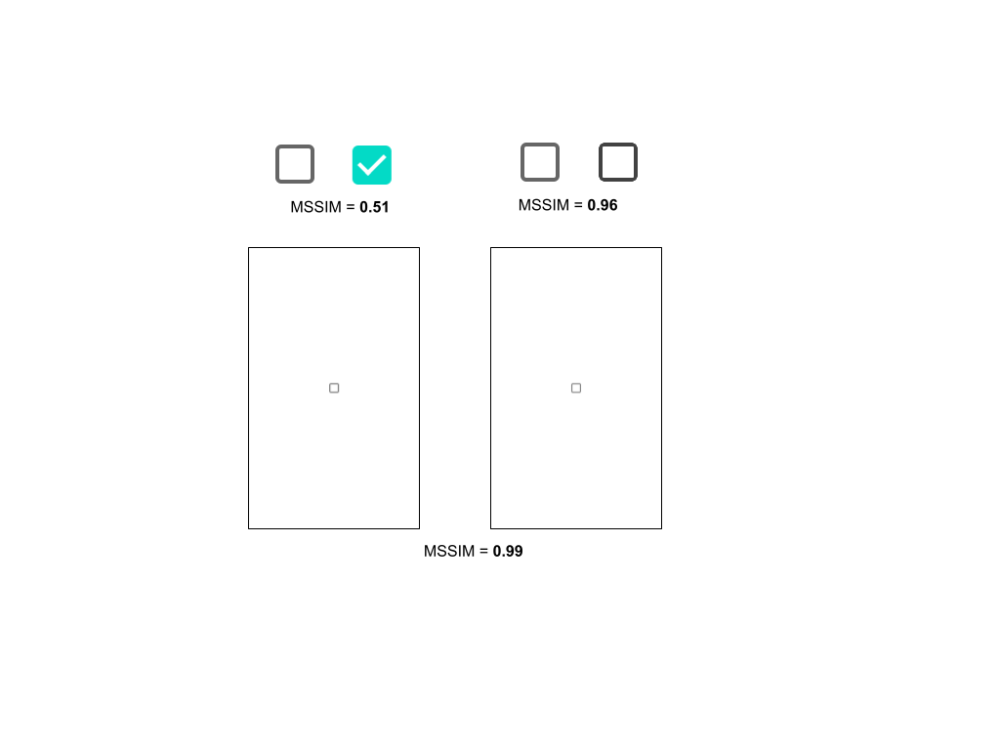
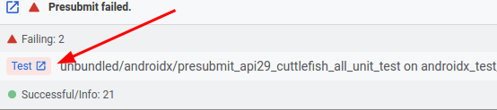
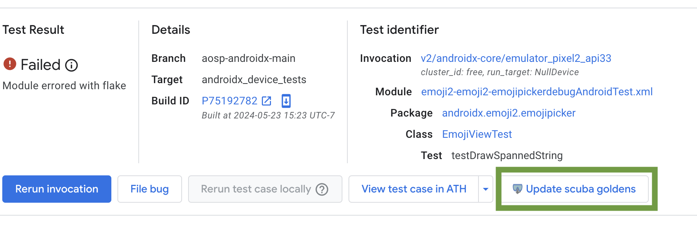
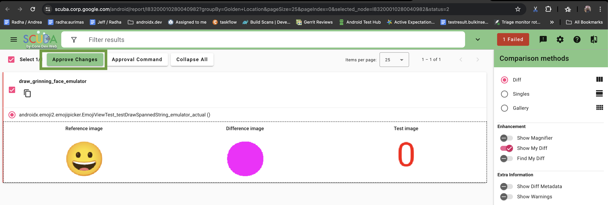
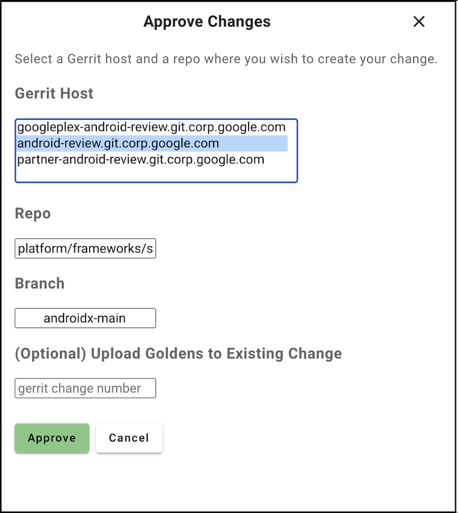

# Testing

[TOC]

AndroidX contains unit and integration tests that are run automatically when a
change is uploaded. It also contains a number of sample applications that are
useful for demonstrating how to use features as well as performing manual
testing.

## Adding tests {#adding}

For an example of how to set up simple unit and integration tests in a new
module, see
[aosp/1189799](https://android-review.googlesource.com/c/platform/frameworks/support/+/1189799).
For an example of how to set up Espresso-powered integration tests, see the
`preference` library's
[`build.gradle`](https://cs.android.com/androidx/platform/frameworks/support/+/androidx-main:preference/preference/build.gradle)
and
[`EditTextPreferenceTest.java`](https://cs.android.com/androidx/platform/frameworks/support/+/androidx-main:preference/preference/src/androidTest/java/androidx/preference/tests/EditTextPreferenceTest.java)
files.

The currently allowed test runners for on-device tests are
[`AndroidJUnitRunner`](https://developer.android.com/training/testing/junit-runner)
and
[`Parameterized`](https://junit.org/junit4/javadoc/4.12/org/junit/runners/Parameterized.html).

NOTE All package/class/method combinations must be unique. Multiple copies of
the same class/method can be included e.g. under different directories, but must
be distinguishable by their packages.

NOTE For best practices on writing libraries in a way that makes it easy for end
users -- and library developers -- to write tests, see the
[Testability](/company/teams/androidx/testability.md) guide.

### Adding a JVM based screenshot test

For UI heavy libraries, it might make sense to add screenshot tests to verify
that everything still renders as expected. For that you need to write the test
([example](https://r.android.com/2428035)) and add new goldens
([example](https://r.android.com/2428721)). You can run these tests just like
any other JVM test using `test` Gradle task.

### Adding screenshots tests using scuba library

#### Prerequisites

Golden project: Make sure that you have the golden directory in your root
checkout (sibling of frameworks directory). If not re-init your repo to fetch
the latest manifest file:

```
$ repo init -u sso://android/platform/manifest \
    -b androidx-main && repo sync -c -j8
```

Set up your module: If your module is not using screenshot tests yet, you need
to do the initial setup.

1.  Modify your gradle file: Add dependency on the diffing library into your
    gradle file:

    ```
    androidTestImplementation project(“:test:screenshot:screenshot”)
    ```

    Important step: Add golden asset directory to be linked to your test apk:

    ```
    android {
        sourceSets.androidTest.assets.srcDirs +=
            // For androidx project (not in ui dir) use "/../../golden/project"
            project.rootDir.absolutePath + "/../../golden/compose/material/material"
    }
    ```

    This will bundle the goldens into your apk so they can be retrieved during
    the test.

2.  Create directory and variable: In the golden directory, create a new
    directory for your module (the directory that you added to your gradle file,
    which in case of material was “compose/material/material”).

    In your test module, create a variable pointing at your new directory:

    ```
    const val GOLDEN_MATERIAL = "compose/material/material"
    ```

#### Adding a screenshot test

Here is an example of a minimal screenshot test for compose material.

```
@LargeTest
@RunWith(JUnit4::class)
@SdkSuppress(minSdkVersion = Build.VERSION_CODES.O)
class CheckboxScreenshotTest {
    @get:Rule val composeTestRule = createComposeRule()
    @get:Rule val screenshotRule = AndroidXScreenshotTestRule(GOLDEN_MATERIAL)

    @Test
    fun checkBoxTest_checked() {
        composeTestRule.setMaterialContent {
            Checkbox(Modifier.wrapContentSize(Alignment.TopStart),
                checked = true,
                onCheckedChange = {}
            )
        }
        find(isToggleable())
            .captureToBitmap()
            .assertAgainstGolden(screenshotRule, "checkbox_checked")
    }
}
```

NOTE: The string “checkbox_checked” is the unique identifier of your golden in
your module. We use that string to name the golden file so avoid special
characters. Please avoid any substrings like: golden, image etc. as there is no
need - instead just describe what the image contains.

#### Guidance around diffing

Try to take the smallest screenshot possible. This will reduce interference from
other elements.

By default we use a MSSIM comparer. This one is based on similarity. However we
have quite a high bar currently which is 0.98 (1 is an exact match). You can
provide your own threshold or even opt into a pixel perfect comparer for some
reason.

Note: The bigger screenshots you take the more you sacrifice in the precision as
you can aggregate larger diffing errors, see the examples below.



#### Generating your goldens in CI (Gerrit)

Upload your CL to gerrit and run presubmit. You should see your test fail.

Step 1: Click on the “Test” button below:



Step 2: Click on the “Update scuba goldens” below:


Step 3: You should see a dashboard similar to the example below. Check-out if
the new screenshots look as expected and if yes click approve. This will create
a new CL.


Step 4: Link your original CL with the new goldens CL by setting the same Topic
field in both CLs (any arbitrary string will do). This tells Gerrit to submit
the CLs together, effectively providing a reference from the original CL to the
new goldens. And re-run presubmit. Your tests should now pass!


#### Running manually / debugging

Screenshot tests can be run locally using pixel 2 api33 emulator. Start the
emulator using [these](#emulator) steps.

Wait until the emulator is running and run the tests as you would on a regular
device.

```
$ ./gradlew <module>:cAT -Pandroid.testInstrumentationRunnerArguments.class=<class>
```

If the test passes, the results are limited to a .textproto file for each
screenshot test. If the test fails, the results will also contain the actual
screenshot and, if available, the golden reference image and the diff between
the two. Note that this means that if you want to regenerate the golden image,
you have to remove the golden image before running the test.

To get the screenshot related results from the device onto your workstation, you
can run

```
$ adb pull /sdcard/Android/data/<test-package>/cache/androidx_screenshots
```

where test-package is the identifier of you test apk, e.g.
androidx.compose.material.test

#### Locally updating the golden images

After you run a screenshot test and pull the results to a desired location,
verify that the actual images are the correct ones and copy them to the golden
screenshots directory (the one you use to create the AndroidXScreenshotTestRule
with) using this script.

```
androidx-main/frameworks/support/development/copy_screenshots_to_golden_repo.py \
--input-dir=/tmp/androidx_screenshots/ --output-dir=androidx-main/golden/<test>/
```

Repeat for all screenshots, then create and upload a CL in the golden
repository.

### What gets tested, and when {#affected-module-detector}

With over 45000 tests executed on every CI run, it is necessary for us to run
only a subset of our instrumentation tests in presubmit. We use the
[AffectedModuleDetector](https://cs.android.com/androidx/platform/frameworks/support/+/androidx-main:buildSrc/private/src/main/kotlin/androidx/build/dependencyTracker/AffectedModuleDetector.kt)
to determine what projects have changed since the last merge. In turn, we only
generate apks and test configurations for those changed modules and their
dependencies.

When changes are made that can't be associated with a module, are in the root of
the checkout, or are within `buildSrc`, then all host tests and all device tests
annotated with `@SmallTest` or `@MediumTest` will be run for all modules.

Presubmit tests represent only a subset of the devices on which our tests run.
The remaining devices are tested only in postsubmit. In postsubmit, all host and
device tests are run for all modules.

### Test annotations {#annotations}

#### Test size and runners {#test-size}

All device tests *should* be given a size annotation, which is one of:

*   [`@SmallTest`](https://developer.android.com/reference/androidx/test/filters/SmallTest)
*   [`@MediumTest`](https://developer.android.com/reference/androidx/test/filters/MediumTest)
*   [`@LargeTest`](https://developer.android.com/reference/androidx/test/filters/LargeTest)

If a device test is *not* annotated with its size, it will be run as if it were
`@LargeTest` by default. Host tests do not need to be annotated with their size,
as all host tests are run regardless of size.

This annotation can occur at either the class level or individual test level.

Annotation    | Max duration
------------- | ------------
`@SmallTest`  | 200ms
`@MediumTest` | 1000ms
`@LargeTest`  | 100000ms

#### Disabling tests {#disabling-tests}

If you need to stop a host- or device-side test from running entirely, use
JUnit's [`@Ignore`](http://junit.sourceforge.net/javadoc/org/junit/Ignore.html)
annotation. Do *not* use Android's `@Suppress` annotation, which only works with
Android test runners and will *not* work for host-side tests.

#### Filtering devices {#filtering-devices}

To restrict a test to a range of SDKs, use
[`@SdkSuppress`](https://developer.android.com/reference/androidx/test/filters/SdkSuppress)
which allows specifying a range with `minSdkVersion` and `maxSdkVersion`. This
annotation also supports targeting a specific pre-release SDK with the
`codeName` parameter.

```java
// Target SDKs 17 through 19, inclusive
@SdkSuppress(minSdkVersion = 17, maxSdkVersion = 19)

// Target pre-release SDK T only
@SdkSuppress(minSdkVersion = Build.VERSION_CODES.TIRAMISU, codeName = "Tiramisu")
```

You may also gate portions of test implementation code using `SDK_INT` or
[`BuildCompat.isAtLeast`](https://developer.android.com/reference/androidx/core/os/BuildCompat)
methods. s To restrict to only physical devices, use
[`@RequiresDevice`](https://developer.android.com/reference/androidx/test/filters/RequiresDevice).

NOTE [Cuttlefish](https://source.android.com/setup/create/cuttlefish) is not
affected by this annotation, only e.g. Studio emulators. If Cuttlefish is
displaying behavior that differs from a physical device, they are considering
that a bug in Cuttlefish, so please file those bugs instead of only looking for
a workaround.

### Animations in tests {#animations}

Animations are disabled for tests by default. This helps avoid flakes due to
timing and also makes tests faster.

In rare cases, like testing the animations themselves, you may want to enable
animations for a particular test or test class. For those cases, you can use the
[`AnimationDurationScaleRule`](https://cs.android.com/androidx/platform/frameworks/support/+/androidx-main:testutils/testutils-runtime/src/main/java/androidx/testutils/AnimationDurationScaleRule.kt).

### Robolectric {#robolectric}

Robolectric tests are supported in AndroidX; however, if you targeting a
pre-release version of the Android SDK then you may see an error like

```
java.lang.IllegalArgumentException: Package targetSdkVersion=31 > maxSdkVersion=30
at org.robolectric.plugins.DefaultSdkPicker.configuredSdks(DefaultSdkPicker.java:118)
at org.robolectric.plugins.DefaultSdkPicker.selectSdks(DefaultSdkPicker.java:69)
```

You can force Robolectric to run using an earlier version of the platform SDK by
creating a `<project>/src/test/resources/robolectric.properties` file with the
following contents:

```
# Robolectric currently doesn't support API 31, so we have to explicitly specify 30 as the target
# sdk for now. Remove when no longer necessary.
sdk=30
```

## Using the emulator {#emulator}

You can use the emulator or a real device to run tests. If you wish to use the
emulator, you will need to access the AVD Manager (and your downloaded emulator
images) using a separate "normal" instance of Android Studio. "Normal" means a
non-Canary build of Studio that you would use for regular app development -- the
important part being that it points to the Android SDK where your downloaded
emulator images reside. You will need to open a project to get the Tools menu --
do NOT open the AndroidX project in the "normal" instance of Android Studio;
instead, open a normal app or create a blank project using the app wizard.

NOTE You can reuse the emulator and system images from a "normal" installation
of Android Studio by linking the `emulator` and `system_images` directories to a
standard Android SDK path and restarting Android Studio. **This is set up
automatically by `studiow` on Google-managed devices with a standard Android SDK
path.** In other cases, it may be set up manually with something like: `cd
prebuilts/fullsdk-darwin ln -s ~/Library/Android/sdk/emulator emulator ln -s
~/Library/Android/sdk/system-images system-images` (substituting `fullsdk-linux`
and your local SDK path as appropriate)

## Debugging with platform SDK sources {#sources}

The platform SDK sources that are checked into the development branch may not
match up with the build of Android present on the emulator or your physical
device. As a result, the line numbers reported by the debugger may not match up
the actual code being run.

If you have a copy of the sources for the build against which you are debugging,
you can manually specify your platform SDK source path:

1.  Click on a module (e.g. `appcompat`) in the `Project` view
1.  Press `Ctrl-Shift-A` and type "Module Settings", then run the action
1.  In the `Project Structure` dialog, navigate to `SDKs > Android API 29
    Platform > Sourcepath`
1.  Use the `-` button to remove any paths that are present, then use the `+`
    button to add the desired source path, ex. `<android checkout
    root>/frameworks/base` if you are debugging against a locally-built system
    image

NOTE The `Project Structure` dialog reachable via `File > Project Structure` is
**not** the same as the `Project Structure` dialog that will allow you to
specify the SDK source path. You must use the "Module Settings" action as
directed above.

## Running unit and integration tests {#running}

From Android Studio, right-click can be used to run most test targets, including
source files, classes within a file, or individual test methods but **not**
entire modules. To run a supported test target, right-click on the test target
and then click `Run <name of test target>`.

To run tests for an entire module such as `appcompat`, use `Run -> Edit
configurations...` and use the `+` button to create a new `Android Instrumented
Tests` configuration. Specify the module to be tested, give it a reasonable name
(not "All Tests") and click `OK`, then use the `Run` menu to run the
configuration.


NOTE If you receive the error `JUnit version 3.8 or later expected` this means
that Android Studio generated an Android JUnit configuration when you actually
needed an Android Instrumented Tests configuration. Open the `Run -> Edit
configurations...` dialog and delete the configuration from Android JUnit, then
manually add a configuration in Android Instrumented Tests.

### From the command line {#running-from-shell}

Following a successful build, tests may be run against a particular AndroidX
module using `gradlew`.

To run all unit or integration tests in a specific project, run the following
from `framework/support`:

```shell
# Run instrumentation tests on a connected device
./gradlew <project-name>:connectedAndroidTest --info

# Run instrumentation tests in Firebase Test Lab (remote)
./gradlew <project-name>:ftlnexus4api21
./gradlew <project-name>:ftlpixel2api26
./gradlew <project-name>:ftlpixel2api28
./gradlew <project-name>:ftlpixel2api30
./gradlew <project-name>:ftlpixel2api33

# Run local unit tests
./gradlew <project-name>:test
```

substituting the Gradle project name (ex. `:core:core`).

To run a specific instrumentation test in a given project, run

```shell
# Run instrumentation tests on a connected device
./gradlew <project-name>:connectedAndroidTest --info \
    -Pandroid.testInstrumentationRunnerArguments.class=<fully-qualified-class>[\#testName]

# Run instrumentation tests on in Firebase Test Lab (remote)
./gradlew <project-name>:ftlpixel2api30 --className=<fully-qualified-class>
```

substituting the Gradle project name (ex. `viewpager`) and fully-qualified class
name (ex. `androidx.viewpager.widget.ViewPagerTest`) of your test file,
optionally followed by `\#testName` if you want to execute a single test in that
file

If you want to run a specific unit test, you can do it using
[`--tests` filtering](https://docs.gradle.org/current/userguide/java_testing.html#test_filtering):

```shell
# Run a test for an Android library on a connected device
./gradlew <project-name>:test --tests androidx.core.view.DisplayCompatTest

# Run a test for a JVM library
./gradlew <project-name>:testDebugUnitTest --tests
androidx.core.view.DisplayCompatTest
```

## Test apps {#testapps}

Library developers are strongly encouraged to write test apps that exercise
their library's public API surface. Test apps serve multiple purposes:

*   Integration testing and validation of API testability, when paired with
    tests
*   Validation of API usability and developer experience, when paired with a use
    case or critical user journey
*   Sample documentation, when embedded into API reference docs using the
    [`@sample` and `@Sampled` annotations](/company/teams/androidx/api_guidelines/index.md#sample-usage)

### Legacy test apps {#testapps-legacy}

We have a set of legacy sample Android applications in projects suffixed with
`-demos`. These applications do not have tests and should not be used as test
apps for new APIs, but they may be useful for manual regression testing.

1.  Click `Run/Debug Configuration` on the top of the window.
1.  Select the app you want to run.
1.  Click 'Run' button.


## Benchmarking {#benchmarking}

AndroidX supports benchmarking - locally with Studio/Gradle, and continuously in
post-submit. For more information on how to create and run benchmarks, see
[Benchmarking](/company/teams/androidx/benchmarking.md).
