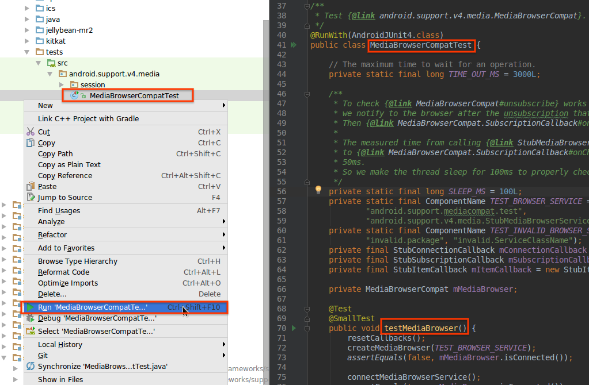

# Testing

[TOC]

AndroidX contains unit and integration tests that are run automatically when a
change is uploaded. It also contains a number of sample applications that are
useful for demonstrating how to use features as well as performing manual
testing.

## Adding tests {#adding}

For an example of how to set up simple unit and integration tests in a new
module, see
[aosp/1189799](https://android-review.googlesource.com/c/platform/frameworks/support/+/1189799).
For an example of how to set up Espresso-powered integration tests, see the
`preference` library's
[`build.gradle`](https://cs.android.com/androidx/platform/frameworks/support/+/androidx-main:preference/preference/build.gradle)
and
[`EditTextPreferenceTest.java`](https://cs.android.com/androidx/platform/frameworks/support/+/androidx-main:preference/preference/src/androidTest/java/androidx/preference/tests/EditTextPreferenceTest.java)
files.

The currently allowed test runners for on-device tests are
[`AndroidJUnitRunner`](https://developer.android.com/training/testing/junit-runner)
and
[`Parameterized`](https://junit.org/junit4/javadoc/4.12/org/junit/runners/Parameterized.html).

NOTE All package/class/method combinations must be unique. Multiple copies of
the same class/method can be included e.g. under different directories, but must
be distinguishable by their packages.

NOTE For best practices on writing libraries in a way that makes it easy for end
users -- and library developers -- to write tests, see the
[Testability](testability.md) guide.

### What gets tested, and when

We use the
[AffectedModuleDetector](https://cs.android.com/androidx/platform/frameworks/support/+/androidx-main:buildSrc/src/main/kotlin/androidx/build/dependencyTracker/AffectedModuleDetector.kt)
to determine what projects have changed since the last merge.

In presubmit, "affected" modules will run all host and device tests regardless
of size. Modules that *depend* on affected modules will run all host tests, but
will only run device tests annotated with `@SmallTest` or `@MediumTest`.

When changes are made that can't be associated with a module, are in the root of
the checkout, or are within `buildSrc`, then all host tests and all device tests
annotated with `@SmallTest` or `@MediumTest` will be run for all modules.

Presubmit tests represent only a subset of the devices on which our tests run.
The remaining devices are tested only in postsubmit. In postsubmit, all host and
device tests are run for all modules.

### Test annotations

#### Test size and runners

All device tests *should* be given a size annotation, which is one of:

*   [`@SmallTest`](https://developer.android.com/reference/androidx/test/filters/SmallTest)
*   [`@MediumTest`](https://developer.android.com/reference/androidx/test/filters/MediumTest)
*   [`@LargeTest`](https://developer.android.com/reference/androidx/test/filters/LargeTest)

If a device test is *not* annotated with its size, it will be run as if it were
`@LargeTest` by default. Host tests do not need to be annotated with their size,
as all host tests are run regardless of size.

This annotation can occur at either the class level or individual test level.

Annotation    | Max duration
------------- | ------------
`@SmallTest`  | 200ms
`@MediumTest` | 1000ms
`@LargeTest`  | 100000ms

#### Disabling tests

To disable a device-side test in presubmit testing only -- but still have it run
in postsubmit -- use the
[`@FlakyTest`](https://developer.android.com/reference/androidx/test/filters/FlakyTest)
annotation. There is currently no support for presubmit-only disabling of
host-side tests.

If you need to stop a host- or device-side test from running entirely, use
JUnit's [`@Ignore`](http://junit.sourceforge.net/javadoc/org/junit/Ignore.html)
annotation. Do *not* use Android's `@Suppress` annotation, which only works with
Android test runners and will *not* work for host-side tests.

#### Filtering devices

To restrict a test to a range of SDKs, use
[`@SdkSuppress`](https://developer.android.com/reference/androidx/test/filters/SdkSuppress)
which allows specifying a range with `minSdkVersion` and `maxSdkVersion`. This
annotation also supports targeting a specific pre-release SDK with the
`codeName` parameter.

```java
// Target SDKs 17 through 19, inclusive
@SdkSuppress(minSdkVersion = 17, maxSdkVersion = 19)

// Target pre-release SDK R only
@SdkSuppress(minSdkVersion = Build.VERSION_CODES.R, isCodeName = "R")
```

You may also gate portions of test implementation code using `SDK_INT` or
[`BuildCompat.isAtLeast`](https://developer.android.com/reference/androidx/core/os/BuildCompat)
methods. s To restrict to only physical devices, use
[`@RequiresDevice`](https://developer.android.com/reference/androidx/test/filters/RequiresDevice).

NOTE [Cuttlefish](https://source.android.com/setup/create/cuttlefish) is not
affected by this annotation, only e.g. Studio emulators. If Cuttlefish is
displaying behavior that differs from a physical device, they are considering
that a bug in Cuttlefish, so please file those bugs instead of only looking for
a workaround.

### Animations in tests

Animations are disabled for tests by default. This helps avoid flakes due to
timing and also makes tests faster.

In rare cases, like testing the animations themselves, you may want to enable
animations for a particular test or test class. For those cases, you can use the
[`AnimationDurationScaleRule`](https://cs.android.com/androidx/platform/frameworks/support/+/androidx-main:testutils/testutils-runtime/src/main/java/androidx/testutils/AnimationDurationScaleRule.kt).

### Robolectric

Robolectric tests are supported in AndroidX; however, if you targeting a
pre-release version of the Android SDK then you may see an error like

```
java.lang.IllegalArgumentException: Package targetSdkVersion=31 > maxSdkVersion=30
at org.robolectric.plugins.DefaultSdkPicker.configuredSdks(DefaultSdkPicker.java:118)
at org.robolectric.plugins.DefaultSdkPicker.selectSdks(DefaultSdkPicker.java:69)
```

You can force Robolectric to run using an earlier version of the platform SDK by
creating a `<project>/src/test/resources/robolectric.properties` file with the
following contents:

```
# Robolectric currently doesn't support API 31, so we have to explicitly specify 30 as the target
# sdk for now. Remove when no longer necessary.
sdk=30
```

## Using the emulator {#emulator}

You can use the emulator or a real device to run tests. If you wish to use the
emulator, you will need to access the AVD Manager (and your downloaded emulator
images) using a separate "normal" instance of Android Studio. "Normal" means a
non-Canary build of Studio that you would use for regular app development -- the
important part being that it points to the Android SDK where your downloaded
emulator images reside. You will need to open a project to get the Tools menu --
do NOT open the AndroidX project in the "normal" instance of Android Studio;
instead, open a normal app or create a blank project using the app wizard.

## Debugging with platform SDK sources {#sources}

The platform SDK sources that are checked into the development branch may not
match up with the build of Android present on the emulator or your physical
device. As a result, the line numbers reported by the debugger may not match up
the actual code being run.

If you have a copy of the sources for the build against which you are debugging,
you can manually specify your platform SDK source path:

1.  Click on a module (e.g. `appcompat`) in the `Project` view
1.  Press `Ctrl-Shift-A` and type "Module Settings", then run the action
1.  In the `Project Structure` dialog, navigate to `SDKs > Android API 29
    Platform > Sourcepath`
1.  Use the `-` button to remove any paths that are present, then use the `+`
    button to add the desired source path, ex. `<android checkout
    root>/frameworks/base` if you are debugging against a locally-built system
    image

NOTE The `Project Structure` dialog reachable via `File > Project Structure` is
**not** the same as the `Project Structure` dialog that will allow you to
specify the SDK source path. You must use the "Module Settings" action as
directed above.

## Running unit and integration tests {#running}

From Android Studio, right-click can be used to run most test targets, including
source files, classes within a file, or individual test methods but **not**
entire modules. To run a supported test target, right-click on the test target
and then click `Run <name of test target>`.

To run tests for an entire module such as `appcompat`, use `Run -> Edit
configurations...` and use the `+` button to create a new `Android Instrumented
Tests` configuration. Specify the module to be tested, give it a reasonable name
(not "All Tests") and click `OK`, then use the `Run` menu to run the
configuration.



NOTE If you receive the error `JUnit version 3.8 or later expected` this means
that Android Studio generated an Android JUnit configuration when you actually
needed an Android Instrumented Tests configuration. Open the `Run -> Edit
configurations...` dialog and delete the configuration from Android JUnit, then
manually add a configuration in Android Instrumented Tests.

### From the command line {#running-from-shell}

Following a successful build, tests may be run against a particular AndroidX
module using `gradlew`.

To run all unit or integration tests in a specific project, run the following
from `framework/support`:

```shell
# Run instrumentation tests on a connected device
./gradlew <project-name>:connectedAndroidTest --info --daemon

# Run local unit tests
./gradlew <project-name>:test --info --daemon
```

substituting the Gradle project name (ex. `core`).

To run all integration tests in the specific project and test class you're
working on, run

```shell
./gradlew <project-name>:connectedAndroidTest --info --daemon \
    -Pandroid.testInstrumentationRunnerArguments.class=<fully-qualified-class>[\#testName]
```

substituting the Gradle project name (ex. `viewpager`) and fully-qualified class
name (ex. `androidx.viewpager.widget.ViewPagerTest`) of your test file,
optionally followed by `\#testName` if you want to execute a single test in that
file. Substitute `test` for `connectedAndroidTest` to run local unit tests.

If you see some weird compilation errors such as below, run `./gradlew clean`
first:

```
Unknown source file : UNEXPECTED TOP-LEVEL EXCEPTION:
Unknown source file : com.android.dex.DexException: Multiple dex files define Landroid/content/pm/ParceledListSlice$1;
```

## Test apps {#testapps}

Library developers are strongly encouraged to write test apps that exercise
their library's public API surface. Test apps serve multiple purposes:

*   Integration testing and validation of API testability, when paired with
    tests
*   Validation of API usability and developer experience, when paired with a use
    case or critical user journey
*   Sample documentation, when embedded into API reference docs using the
    [`@sample` and `@Sampled` annotations](api_guidelines.md#sample-usage)

### Legacy test apps {#testapps-legacy}

We have a set of legacy sample Android applications in projects suffixed with
`-demos`. These applications do not have tests and should not be used as test
apps for new APIs, but they may be useful for manual regression testing.

1.  Click `Run/Debug Configuration` on the top of the window.
1.  Select the app you want to run.
1.  Click 'Run' button.


## Benchmarking {#benchmarking}

AndroidX supports benchmarking - locally with Studio/Gradle, and continuously in
post-submit. For more information on how to create and run benchmarks, see
[Benchmarking](benchmarking.md).
